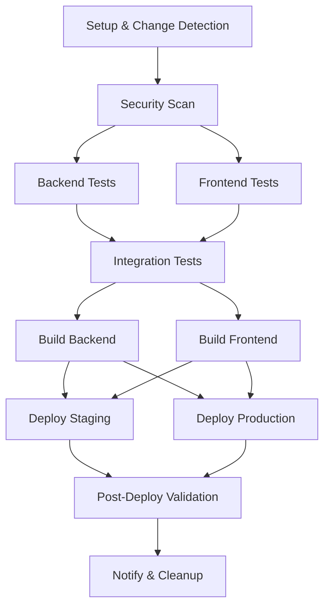

# Vimarsh CI/CD Workflows

## Unified Pipeline Architecture

This directory contains a single, unified CI/CD pipeline that follows DAG (Directed Acyclic Graph) principles for optimal efficiency and reliability.

### Pipeline Stages

### Key Features

- **🎯 Intelligent Execution**: Only runs necessary stages based on change detection
- **🔒 Security First**: Integrated security scanning before any deployments
- **⚡ Parallel Processing**: Backend and frontend tests run in parallel
- **🏗️ Artifact-Based Deployment**: Builds once, deploys multiple times
- **📊 Comprehensive Monitoring**: Full visibility into pipeline health
- **🧹 Resource Management**: Automatic cleanup of temporary resources

### Workflow Files

- `unified-ci-cd.yml` - Main CI/CD pipeline (replaces all previous workflows)

### Migration History

Previous workflows have been consolidated:
- `ci-cd.yml` → Merged into unified pipeline
- `ci-cd-optimized.yml` → Merged into unified pipeline  
- `test.yml` → Merged into unified pipeline
- `test-optimized.yml` → Merged into unified pipeline
- `vimarsh-optimized-test-suite.yml` → Merged into unified pipeline
- `deploy.yml` → Integrated into unified pipeline

Backups are stored in `backup-*` directories.

### Usage

The unified pipeline automatically:
1. Detects what changed in your commit
2. Runs only the necessary tests and builds
3. Deploys to appropriate environments based on branch
4. Provides comprehensive feedback and notifications

No manual intervention required - the pipeline is fully automated and intelligent.
