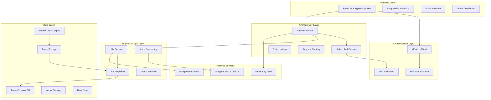
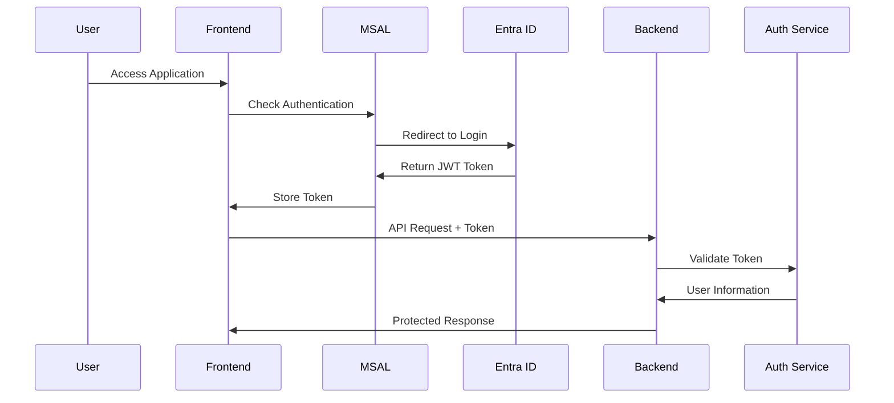

# Design Document: Vimarsh AI-Powered Conversational Platform

## Overview

This design document provides comprehensive technical architecture and implementation details for the Vimarsh AI-powered conversational platform. The system leverages Retrieval-Augmented Generation (RAG) with Google Gemini Pro, Azure cloud infrastructure, and React-based frontend to deliver authentic conversations with historical, spiritual, and scientific personalities through their curated knowledge bases. Lord Krishna serves as the flagship personality, with the architecture designed to support Einstein, Lincoln, Marcus Aurelius, and many other great minds.

## Architecture

### High-Level System Architecture



### Deployment Architecture

**Two-Resource-Group Strategy:**
- **vimarsh-persistent-rg**: Data persistence (Cosmos DB, Key Vault, Storage)
- **vimarsh-compute-rg**: Compute resources (Functions, Web App, Monitoring)

**Pause-Resume Cost Optimization:**
- Active Production: $50-100/month
- Paused State: $5-10/month (90% cost reduction)
- Resume Time: <10 minutes with zero data loss

## Components and Interfaces

### Frontend Components

#### Core React Components
```typescript
// Main Application Structure
interface AppProps {
  msalInstance: PublicClientApplication;
}

interface SpiritualGuidanceProps {
  user?: AuthenticatedUser;
  language: SupportedLanguage;
  voiceEnabled: boolean;
}

interface AdminDashboardProps {
  adminUser: AdminUser;
  permissions: UserPermissions;
}
```

#### Voice Interface Integration
```typescript
interface VoiceInterfaceProps {
  onSpeechResult: (transcript: string) => void;
  onSpeechError: (error: SpeechRecognitionError) => void;
  language: 'en-US' | 'hi-IN';
  isListening: boolean;
}

interface TTSConfiguration {
  voice: SpeechSynthesisVoice;
  rate: number; // 0.7-1.0 for contemplative pace
  pitch: number; // -2.0 to -1.0 for reverent tone
  volume: number;
}
```

### Backend Services

#### Unified Authentication Service
```python
class UnifiedAuthService:
    """Consolidated authentication service supporting multiple modes"""
    
    def __init__(self, mode: AuthenticationMode, application: str):
        self.mode = mode
        self.application = application
        self.is_enabled = self._get_auth_enabled()
    
    async def validate_token(self, token: str) -> Optional[AuthenticatedUser]:
        """Validate JWT token and return user information"""
        
    async def check_admin_permissions(self, user: AuthenticatedUser) -> UserPermissions:
        """Check admin permissions for user"""
        
    def require_auth(self, required_permissions: List[str] = None):
        """Decorator for protecting endpoints"""
```

#### LLM Service Architecture
```python
class PromptTemplates:
    """Database-backed template system for versioned prompt management"""
    
    def __init__(self, db_service: DatabaseService):
        self.db_service = db_service
        self.template_cache = LRUCache(maxsize=100)
    
    async def get_template(
        self,
        template_id: str,
        personality_id: str = None,
        version: str = "latest"
    ) -> PromptTemplate:
        """Retrieve a specific prompt template with version control"""
        
    async def create_template(
        self,
        template_data: PromptTemplateData,
        author_id: str
    ) -> PromptTemplate:
        """Create a new prompt template with version tracking"""
        
    async def update_template(
        self,
        template_id: str,
        template_updates: Dict[str, Any],
        author_id: str
    ) -> PromptTemplate:
        """Update a prompt template, creating a new version"""
        
    async def render_template(
        self,
        template_id: str,
        template_variables: Dict[str, Any],
        personality_id: str = None,
        version: str = "latest"
    ) -> str:
        """Render a prompt template with provided variables"""
```

```python
class EnhancedLLMService:
    """Production-ready LLM service with multi-personality context awareness"""
    
    def __init__(
        self, 
        safety_level: SafetyLevel = SafetyLevel.STRICT,
        db_service: DatabaseService = None
    ):
        self.safety_level = safety_level
        self.gemini_client = self._initialize_gemini()
        self.token_tracker = TokenTracker()
        self.personality_manager = PersonalityManager()
        self.prompt_templates = PromptTemplates(db_service)
    
    async def generate_personality_response(
        self,
        query: str,
        context: List[RetrievedChunk],
        personality: PersonalityProfile,
        language: str = "English",
        conversation_context: ConversationContext = None
    ) -> PersonalityResponse:
        """Generate contextually appropriate response for any personality"""
        # Get the appropriate prompt template for this personality
        prompt = await self._construct_personality_prompt(
            query, context, personality, language
        )
        
        # Generate response using the template
        # Implementation continues...
        
    async def _construct_personality_prompt(
        self,
        query: str,
        context: List[RetrievedChunk],
        personality: PersonalityProfile,
        language: str
    ) -> str:
        """Construct prompt using versioned templates for the selected personality"""
        # Get the base template for this personality type
        template = await self.prompt_templates.get_template(
            template_id=f"personality_{personality.domain}",
            personality_id=personality.id
        )
        
        # Render the template with context variables
        rendered_prompt = await self.prompt_templates.render_template(
            template_id=template.id,
            template_variables={
                "QUERY": query,
                "CONTEXT": self._format_context(context),
                "PERSONALITY_PROFILE": personality.to_prompt_format(),
                "LANGUAGE": language,
                "TONE_GUIDELINES": personality.tone_guidelines,
                "RESPONSE_PATTERNS": personality.response_patterns
            },
            personality_id=personality.id
        )
        
        return rendered_prompt
        # Uses PromptTemplateManager for versioned, testable prompt templates
        return self.prompt_template_manager.render_personality_prompt(
            personality.id, query, context, language, conversation_context
        )

class PromptTemplateManager:
    """Manages versioned prompt templates for A/B testing and refinement"""
    
    def __init__(self, db_service: DatabaseService):
        self.db_service = db_service
        self.template_cache = LRUCache(maxsize=100)
    
    def render_personality_prompt(
        self,
        personality_id: str,
        query: str,
        context: List[RetrievedChunk],
        language: str,
        conversation_context: ConversationContext = None
    ) -> str:
        """Render personality-specific prompt from versioned templates with conversation history"""
```

#### RAG Pipeline Implementation
```python
class RAGPipeline:
    """Retrieval-Augmented Generation pipeline for multi-domain knowledge bases"""
    
    def __init__(self, vector_db: VectorDatabase):
        self.vector_db = vector_db
        self.embedding_model = SentenceTransformer('all-MiniLM-L6-v2')
        # Note: For specialized domains (Sanskrit, scientific), consider domain-specific models
        # or fine-tuned embeddings for better semantic understanding
        self.domain_processors = {
            'spiritual': SpiritualTextProcessor(),
            'historical': HistoricalTextProcessor(),
            'scientific': ScientificTextProcessor(),
            'philosophical': PhilosophicalTextProcessor()
        }
    
    async def retrieve_personality_context(
        self,
        query: str,
        personality_id: str,
        k: int = 10,
        similarity_threshold: float = 0.7
    ) -> List[RetrievedChunk]:
        """Retrieve relevant chunks from personality-specific knowledge base"""
        
    async def process_personality_content(
        self,
        content: str,
        personality_profile: PersonalityProfile,
        source_metadata: SourceMetadata
    ) -> List[ProcessedChunk]:
        """Process and chunk content with personality-specific optimization"""
```

### Personality Management Architecture

#### Personality System Design

```python
class PersonalityManager:
    """Central personality management system"""
    
    def __init__(self, db_service: DatabaseService):
        self.db_service = db_service
        self.personality_cache = LRUCache(maxsize=100)
        self.knowledge_base_manager = KnowledgeBaseManager()
    
    async def create_personality(
        self,
        profile: PersonalityProfile,
        knowledge_sources: List[KnowledgeSource]
    ) -> Personality:
        """Create new personality with associated knowledge base"""
        
    async def get_personality_response(
        self,
        personality_id: str,
        query: str,
        context: ConversationContext
    ) -> PersonalityResponse:
        """Generate personality-specific response"""
        
    async def manage_knowledge_base(
        self,
        personality_id: str,
        operation: KnowledgeOperation
    ) -> OperationResult:
        """Manage personality-specific knowledge base"""
```

#### Web-Based Admin Interface Architecture

```typescript
interface AdminInterface {
  personalityManager: PersonalityManagerComponent;
  contentManager: ContentManagerComponent;
  systemMonitor: SystemMonitorComponent;
  userManager: UserManagerComponent;
}

interface PersonalityManagerComponent {
  createPersonality: (profile: PersonalityProfile) => Promise<Personality>;
  editPersonality: (id: string, updates: PersonalityUpdates) => Promise<void>;
  deletePersonality: (id: string, options: DeletionOptions) => Promise<void>;
  associateContent: (personalityId: string, contentIds: string[]) => Promise<void>;
  testPersonality: (id: string, testQueries: string[]) => Promise<TestResults>;
}

interface ContentManagerComponent {
  uploadContent: (files: FileList, metadata: ContentMetadata) => Promise<UploadResult>;
  processContent: (contentId: string, processingOptions: ProcessingOptions) => Promise<void>;
  reviewContent: (contentId: string, reviewData: ReviewData) => Promise<void>;
  organizeContent: (organizationRules: OrganizationRules) => Promise<void>;
}
```

### Database Schema

#### Cosmos DB Collections

**personalities Collection:**
```json
{
  "id": "krishna_bhagavad_gita",
  "name": "Lord Krishna",
  "domain": "spiritual",
  "description": "Divine teacher and guide from the Bhagavad Gita",
  "profile": {
    "tone": "reverent, wise, compassionate",
    "vocabulary": "elevated, spiritual, Sanskrit terms",
    "expertise_areas": ["dharma", "karma", "devotion", "self-realization"],
    "historical_period": "ancient_india",
    "cultural_context": "hindu_philosophy"
  },
  "knowledge_base_ids": ["bhagavad_gita_chunks", "mahabharata_chunks"],
  "response_patterns": {
    "greeting": "Namaste, dear child. How may I guide you?",
    "farewell": "May you walk in dharma and find peace.",
    "uncertainty": "This wisdom is not found in the texts I know."
  },
  "voice_settings": {
    "language": "en-US",
    "voice_name": "en-US-Neural2-J",
    "speaking_rate": 0.85,
    "pitch": -2.0
  },
  "version": "1.0",
  "status": "active",
  "created_by": "admin@vedprakash.net",
  "created_at": "2025-07-20T00:00:00Z",
  "last_updated": "2025-07-20T00:00:00Z"
}
```

**knowledge-base Collection:**
```json
{
  "id": "bhagavad_gita_chapter_2_verse_47",
  "text": "You have a right to perform your prescribed duty...",
  "source": "Bhagavad Gita",
  "chapter": 2,
  "verse": 47,
  "book": "bhagavad_gita",
  "embedding": [0.1, 0.2, ...], // 384-dimensional vector
  "metadata": {
    "author": "Vyasa",
    "translator": "Kisari Mohan Ganguli",
    "public_domain": true,
    "processed_date": "2025-07-20T00:00:00Z",
    "domain": "spiritual",
    "content_type": "scripture"
  },
  "personality_associations": ["krishna"],
  "domain_themes": ["duty", "action", "detachment"],
  "partition_key": "krishna" // For efficient personality-specific queries
  // Note: Cross-personality queries (e.g., all spiritual domain_themes) will be 
  // less efficient as they require cross-partition queries. Consider secondary 
  // indexing on domain_themes if such patterns become critical.
}

// Example for Einstein
{
  "id": "relativity_theory_chapter_1_section_3",
  "text": "The principle of relativity in the restricted sense...",
  "source": "Relativity: The Special and General Theory",
  "chapter": 1,
  "section": 3,
  "book": "relativity_theory",
  "embedding": [0.3, 0.4, ...],
  "metadata": {
    "author": "Albert Einstein",
    "publication_year": 1916,
    "public_domain": true,
    "processed_date": "2025-07-20T00:00:00Z",
    "domain": "scientific",
    "content_type": "theory"
  },
  "personality_associations": ["einstein"],
  "domain_themes": ["relativity", "spacetime", "physics"],
  "partition_key": "einstein"
}
```

**personalities Collection:**
```json
{
  "id": "krishna",
  "name": "Lord Krishna",
  "domain": "spiritual",
  "time_period": "Ancient India (3000+ BCE)",
  "description": "Divine teacher and guide, central figure in Hindu philosophy",
  "knowledge_base_ids": ["bhagavad_gita", "mahabharata", "srimad_bhagavatam"],
  "tone_characteristics": {
    "formality": "elevated",
    "warmth": "compassionate",
    "authority": "divine",
    "teaching_style": "parabolic"
  },
  "vocabulary_preferences": {
    "sanskrit_terms": true,
    "metaphorical_language": true,
    "spiritual_concepts": true
  },
  "response_patterns": {
    "greeting_style": "O child",
    "explanation_approach": "story_and_principle",
    "citation_style": "verse_reference"
  },
  "expertise_areas": ["dharma", "karma", "devotion", "duty", "liberation"],
  "cultural_context": "Hindu philosophy and tradition",
  "language_style": "reverent and dignified",
  "is_active": true,
  "created_at": "2025-07-20T00:00:00Z"
}

// Example for Einstein
{
  "id": "einstein",
  "name": "Albert Einstein",
  "domain": "scientific",
  "time_period": "20th Century (1879-1955)",
  "description": "Theoretical physicist, developer of relativity theory",
  "knowledge_base_ids": ["relativity_theory", "einstein_papers", "einstein_letters"],
  "tone_characteristics": {
    "formality": "academic",
    "warmth": "curious",
    "authority": "scientific",
    "teaching_style": "thought_experiment"
  },
  "vocabulary_preferences": {
    "scientific_terms": true,
    "mathematical_concepts": true,
    "philosophical_inquiry": true
  },
  "response_patterns": {
    "greeting_style": "My friend",
    "explanation_approach": "logical_progression",
    "citation_style": "paper_reference"
  },
  "expertise_areas": ["physics", "relativity", "quantum_theory", "philosophy_of_science"],
  "cultural_context": "20th century scientific revolution",
  "language_style": "thoughtful and precise",
  "is_active": true,
  "created_at": "2025-07-20T00:00:00Z"
}

**conversations Collection:**
```json
{
  "id": "conv_user123_krishna_20250720_001",
  "user_id": "user123",
  "personality_id": "krishna",
  "session_id": "session_abc123",
  "messages": [
    {
      "id": "msg_001",
      "sender": "user",
      "text": "What is dharma?",
      "timestamp": "2025-07-20T10:00:00Z"
    },
    {
      "id": "msg_002",
      "sender": "ai",
      "text": "O child, dharma is the eternal law...",
      "citations": ["BG 4.7", "MB 12.109"],
      "personality_id": "krishna",
      "language": "English",
      "timestamp": "2025-07-20T10:00:05Z"
    }
  ],
  "created_at": "2025-07-20T10:00:00Z",
  "updated_at": "2025-07-20T10:30:00Z",
  "partition_key": "user123_krishna" // For efficient user-personality queries
}
```

## Technical Considerations and Implementation Notes

### Embedding Model Strategy
```python
# Note: Embedding model selection requires domain-specific optimization
# Initial model: all-MiniLM-L6-v2 (general purpose, 384 dimensions)
# Future considerations: Fine-tuning for Sanskrit, scientific terminology

class EmbeddingModelManager:
    """Manages embedding models with domain-specific optimization"""
    
    def __init__(self):
        self.default_model = 'all-MiniLM-L6-v2'  # General purpose baseline
        self.domain_models = {
            'spiritual': 'all-MiniLM-L6-v2',  # Consider fine-tuning for Sanskrit
            'scientific': 'all-MiniLM-L6-v2',  # May need specialized scientific model
            'historical': 'all-MiniLM-L6-v2'   # May need historical context model
        }
    
    def get_model_for_domain(self, domain: str) -> str:
        """Get optimal embedding model for domain with fallback"""
        return self.domain_models.get(domain, self.default_model)
```

### Rate Limiting Configuration
```python
# Tiered rate limiting appropriate for conversational AI usage patterns
RATE_LIMIT_TIERS = {
    'anonymous': {
        'window_seconds': 300,    # 5 minutes
        'max_requests': 20,       # 20 requests per 5 minutes
        'burst_allowance': 5      # Allow small bursts
    },
    'authenticated': {
        'window_seconds': 300,    # 5 minutes  
        'max_requests': 50,       # 50 requests per 5 minutes
        'burst_allowance': 10
    },
    'premium': {
        'window_seconds': 300,    # 5 minutes
        'max_requests': 100,      # 100 requests per 5 minutes
        'burst_allowance': 20
    }
}
```

### Content Processing Priorities
```python
# File format support prioritization for realistic implementation
SUPPORTED_FORMATS = {
    'tier_1': ['txt', 'html'],           # Full support, high accuracy
    'tier_2': ['pdf'],                   # Good support, manual review recommended
    'tier_3': ['docx', 'epub'],          # Basic support, expert validation required
    'future': ['scanned_pdf', 'images']  # OCR-based, future enhancement
}
```

## Data Models

### Core Data Structures

#### Personality Response Model
```python
@dataclass
class PersonalityResponse:
    text: str
    citations: List[Citation]
    personality_id: str
    personality_name: str
    language: str = "English"
    confidence_score: float = 0.0
    domain_themes: List[str] = field(default_factory=list)
    specialized_terms: List[SpecializedTerm] = field(default_factory=list)
    audio_url: Optional[str] = None
    conversation_id: str = ""
    generated_at: datetime = field(default_factory=datetime.now)

@dataclass
class PersonalityProfile:
    personality_id: str
    name: str
    domain: PersonalityDomain  # SPIRITUAL, HISTORICAL, SCIENTIFIC, PHILOSOPHICAL
    time_period: str
    description: str
    knowledge_base_ids: List[str]
    tone_characteristics: Dict[str, Any]
    vocabulary_preferences: Dict[str, Any]
    response_patterns: Dict[str, Any]
    expertise_areas: List[str]
    cultural_context: str
    language_style: str
    created_at: datetime
    updated_at: datetime
    is_active: bool = True
```

#### Citation Model
```python
@dataclass
class Citation:
    source: str  # "Bhagavad Gita", "Mahabharata", etc.
    reference: str  # "2.47", "Book 5, Section 28"
    text_snippet: str
    chapter: Optional[int] = None
    verse: Optional[int] = None
    book: Optional[str] = None
    url: Optional[str] = None
```

#### User Authentication Model
```python
@dataclass
class AuthenticatedUser:
    user_id: str
    email: str
    name: str
    roles: List[UserRole]
    permissions: UserPermissions
    authentication_mode: AuthenticationMode
    token_expires_at: datetime
    created_at: datetime
    last_active: datetime
```

### Admin Data Models

#### System Metrics Model
```python
@dataclass
class SystemMetrics:
    active_users: int
    total_conversations: int
    avg_response_time: float
    system_load: float
    llm_usage: LLMUsageMetrics
    cost_metrics: CostMetrics
    error_rate: float
    cache_hit_rate: float
    timestamp: datetime
```

#### Cost Tracking Model
```python
@dataclass
class CostMetrics:
    daily_budget: float
    used_amount: float
    remaining_budget: float
    tokens_used: int
    avg_cost_per_query: float
    cost_breakdown: Dict[str, float]
    period_start: datetime
    period_end: datetime
```

## Error Handling

### Error Classification System

```python
class SpiritualGuidanceError(Exception):
    """Base exception for spiritual guidance system"""
    
class AuthenticationError(SpiritualGuidanceError):
    """Authentication and authorization errors"""
    
class RAGRetrievalError(SpiritualGuidanceError):
    """RAG pipeline and retrieval errors"""
    
class LLMGenerationError(SpiritualGuidanceError):
    """LLM generation and processing errors"""
    
class ContentValidationError(SpiritualGuidanceError):
    """Content validation and safety errors"""
```

### Error Response Patterns

```python
@dataclass
class ErrorResponse:
    error_code: str
    message: str
    spiritual_context: str  # Reverent error message
    suggested_action: str
    timestamp: datetime
    request_id: str
    
    @classmethod
    def create_spiritual_error(
        cls,
        error: Exception,
        language: str = "English"
    ) -> 'ErrorResponse':
        """Create spiritually appropriate error response"""
```

### Graceful Degradation Strategy

1. **LLM Service Failure**: Fallback to cached responses or pre-written guidance
2. **RAG Retrieval Failure**: Use general spiritual principles without specific citations
3. **Authentication Failure**: Graceful degradation to anonymous access
4. **Voice Service Failure**: Fallback to text-only interaction
5. **Database Failure**: Use local caching and queue operations for retry

## Testing Strategy

### Test Coverage Framework

#### Unit Testing
```python
class TestLLMService:
    """Comprehensive LLM service testing"""
    
    def test_spiritual_response_generation(self):
        """Test spiritual guidance generation"""
        
    def test_persona_consistency(self):
        """Test Lord Krishna persona maintenance"""
        
    def test_citation_accuracy(self):
        """Test citation extraction and validation"""
        
    def test_safety_filtering(self):
        """Test content safety and appropriateness"""
```

#### Integration Testing
```python
class TestRAGPipeline:
    """End-to-end RAG pipeline testing"""
    
    def test_text_retrieval_accuracy(self):
        """Test retrieval accuracy and relevance"""
        
    def test_embedding_consistency(self):
        """Test embedding generation consistency"""
        
    def test_citation_preservation(self):
        """Test citation metadata preservation"""
```

#### Performance Testing
```python
class TestPerformanceBenchmarks:
    """Performance benchmark validation"""
    
    def test_response_time_targets(self):
        """Validate response time requirements"""
        
    def test_concurrent_user_handling(self):
        """Test concurrent user capacity"""
        
    def test_memory_efficiency(self):
        """Test memory usage optimization"""
```

### Quality Assurance Framework

#### Spiritual Content Validation
```python
class SpiritualContentValidator:
    """Validate spiritual content authenticity"""
    
    def validate_tone_appropriateness(self, response: str) -> float:
        """Score response tone appropriateness (0-1)"""
        
    def validate_citation_accuracy(self, citations: List[Citation]) -> bool:
        """Validate citation accuracy against source texts"""
        
    def validate_cultural_sensitivity(self, response: str) -> bool:
        """Validate cultural sensitivity and respect"""
```

#### Expert Review Integration
```python
class ExpertReviewSystem:
    """Integration with expert review processes"""
    
    def submit_for_review(
        self,
        response: SpiritualResponse,
        priority: ReviewPriority
    ) -> ReviewTicket:
        """Submit response for expert validation"""
        
    def process_expert_feedback(
        self,
        ticket: ReviewTicket,
        feedback: ExpertFeedback
    ) -> None:
        """Process and integrate expert feedback"""
```

## Security Architecture

### Authentication Flow



### Security Controls Implementation

#### Input Validation and Sanitization
```python
class SecurityValidator:
    """Comprehensive input validation and sanitization"""
    
    def sanitize_user_input(self, input_text: str) -> str:
        """Sanitize user input preventing XSS and injection"""
        
    def validate_spiritual_query(self, query: str) -> ValidationResult:
        """Validate spiritual query appropriateness"""
        
    def filter_sensitive_data(self, response: str) -> str:
        """Filter sensitive information from responses"""
```

#### Rate Limiting Implementation
```python
class SlidingWindowRateLimiter:
    """Sliding window rate limiting with token bucket algorithm for burst handling"""
    
    def __init__(self, 
                 anonymous_limits: Dict[str, Any] = {"window": 300, "requests": 20, "burst": 5},
                 authenticated_limits: Dict[str, Any] = {"window": 300, "requests": 50, "burst": 10},
                 premium_limits: Dict[str, Any] = {"window": 300, "requests": 100, "burst": 20}):
        self.anonymous_limits = anonymous_limits
        self.authenticated_limits = authenticated_limits
        self.premium_limits = premium_limits
        self.request_log = {}
        self.token_buckets = {}  # For token bucket algorithm implementation
    
    def is_allowed(self, user_id: str, ip_address: str) -> bool:
        """Check if request is allowed using token bucket algorithm for burst handling"""
        # Get appropriate limits based on user tier
        limits = self._get_user_limits(user_id)
        
        # Get or create token bucket for this user/IP
        bucket = self._get_token_bucket(user_id, ip_address)
        
        # Check if request is allowed based on token availability
        # Token bucket algorithm allows for controlled bursts while
        # maintaining overall rate limits across the window
        return bucket.consume(1)
    
    def _get_token_bucket(self, user_id: str, ip_address: str) -> TokenBucket:
        """Get or create token bucket with appropriate configuration"""
        key = f"{user_id}:{ip_address}"
        if key not in self.token_buckets:
            limits = self._get_user_limits(user_id)
            self.token_buckets[key] = TokenBucket(
                capacity=limits["burst"],
                refill_rate=limits["requests"] / limits["window"],
                current_tokens=limits["burst"]
            )
        return self.token_buckets[key]
        
    def get_spiritual_rate_limit_message(self, language: str) -> str:
        """Return spiritually appropriate rate limit message"""
```

## Performance Optimization

### Caching Strategy

#### Multi-Level Caching Architecture
```python
class CacheManager:
    """Multi-level caching for optimal performance"""
    
    def __init__(self):
        self.l1_cache = LRUCache(maxsize=1000)  # In-memory
        self.l2_cache = RedisCache()  # Distributed
        self.l3_cache = CosmosDBCache()  # Persistent
    
    async def get_cached_response(
        self,
        query_hash: str,
        language: str
    ) -> Optional[SpiritualResponse]:
        """Retrieve cached response with fallback strategy"""
        
    async def cache_response(
        self,
        query_hash: str,
        response: SpiritualResponse,
        ttl: int = 3600
    ) -> None:
        """Cache response with appropriate TTL"""
```

### Memory Management

#### Optimized Token Tracking
```python
class OptimizedTokenTracker:
    """Memory-efficient token usage tracking"""
    
    def __init__(self, max_cache_size: int = 10000):
        self.usage_cache = LRUCache(maxsize=max_cache_size)
        self.aggregated_stats = {}
    
    def track_usage(
        self,
        user_id: str,
        tokens_used: int,
        cost: float
    ) -> None:
        """Track token usage with memory optimization"""
        
    def get_usage_summary(self, user_id: str) -> UsageSummary:
        """Get usage summary with efficient aggregation"""
```

## Monitoring and Observability

### Metrics Collection Framework

```python
class SpiritualGuidanceMetrics:
    """Comprehensive metrics collection for spiritual guidance system"""
    
    def __init__(self):
        self.performance_metrics = PerformanceMetrics()
        self.quality_metrics = QualityMetrics()
        self.user_metrics = UserMetrics()
        self.cost_metrics = CostMetrics()
    
    def record_guidance_request(
        self,
        user_id: str,
        query: str,
        response_time: float,
        quality_score: float
    ) -> None:
        """Record comprehensive guidance request metrics"""
        
    def generate_dashboard_data(self) -> DashboardData:
        """Generate real-time dashboard data"""
```

### Health Check System

```python
class HealthChecker:
    """Comprehensive system health monitoring"""
    
    async def check_llm_service_health(self) -> HealthStatus:
        """Check LLM service availability and performance"""
        
    async def check_database_health(self) -> HealthStatus:
        """Check database connectivity and performance"""
        
    async def check_rag_pipeline_health(self) -> HealthStatus:
        """Check RAG pipeline functionality"""
        
    async def generate_health_report(self) -> HealthReport:
        """Generate comprehensive health report"""
```

---

**Document Version:** 1.0  
**Last Updated:** July 20, 2025  
**Status:** Approved for Implementation  
**Architecture Review:** Completed  
**Security Review:** Completed