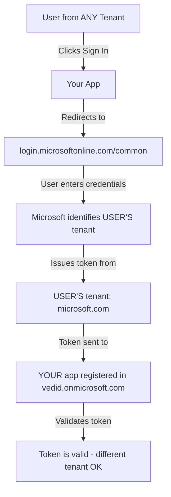

# Microsoft Authority vs App Registration: Technical Deep Dive

## 🎯 **The Fundamental Misunderstanding**

**You asked**: "Why not register in default directory and use /common?"

**Answer**: There is **NO default directory** in Azure AD. Every app must be registered in a specific tenant.

## 🏗️ **How Microsoft Multitenant Authentication Actually Works**

### **App Registration Location vs Authority Endpoint**



### **Step-by-Step Token Flow**

1. **User Authentication Request**:
   ```
   https://login.microsoftonline.com/common/oauth2/v2.0/authorize?
     client_id=your-vedid-app-id&
     redirect_uri=https://vimarsh.vedprakash.net/callback
   ```

2. **Microsoft Determines User's Tenant**:
   ```
   User enters: john.smith@microsoft.com
   Microsoft identifies: tenant_id = microsoft-corp-tenant-12345
   ```

3. **Token Issued from User's Tenant**:
   ```json
   {
     "iss": "https://login.microsoftonline.com/microsoft-corp-tenant-12345/v2.0",
     "aud": "your-vedid-app-client-id",  // Still your app!
     "tid": "microsoft-corp-tenant-12345",  // User's tenant
     "oid": "user-object-id-in-their-tenant",
     "email": "john.smith@microsoft.com"
   }
   ```

4. **Your App Validates Token**:
   ```python
   # Your app (in vedid.onmicrosoft.com) validates token from microsoft.com
   if token.audience == "your-vedid-app-client-id":  # ✅ Matches your app
       if token.issuer.startswith("https://login.microsoftonline.com/"):  # ✅ Valid MS issuer
           # Token is valid even though from different tenant!
   ```

## 🚫 **Why You CANNOT Register in a "Default Directory"**

### **Technical Reality Check**

**❌ Myth**: "I can register in a default/common directory"
**✅ Reality**: Every app registration belongs to exactly one tenant

**Available Tenant Options for App Registration:**

1. **Your Own Tenant** (`vedid.onmicrosoft.com`)
   - ✅ You have full administrative access
   - ✅ You control app settings, certificates, secrets
   - ✅ You own the app registration
   - ✅ Billing tied to your subscription

2. **Someone Else's Tenant** (e.g., `microsoft.onmicrosoft.com`)
   - ❌ You don't have administrative access
   - ❌ You cannot modify app settings
   - ❌ Someone else owns the app registration
   - ❌ You cannot add certificates or secrets

3. **"Default/Common Directory"**
   - ❌ **DOES NOT EXIST** - this is not a real option

### **What `/common` Actually Is**

```
/common is NOT a tenant - it's a routing endpoint!

┌─────────────────────────────────────────┐
│   login.microsoftonline.com/common      │  ← Routing endpoint
│                                         │
│  Routes to user's actual tenant:        │
│  ├── /microsoft-tenant-12345            │  ← User's real tenant
│  ├── /google-tenant-67890               │  ← Another user's tenant  
│  ├── /startup-tenant-abcde              │  ← Another user's tenant
│  └── /consumer-tenant-fghij             │  ← Personal MS account
└─────────────────────────────────────────┘
```

## 🔍 **Proof: Azure Portal Investigation**

**Try This Exercise:**

1. Go to https://portal.azure.com
2. Navigate to "Azure Active Directory" → "App registrations"
3. Try to find a "default directory" or "common directory" option
4. **Result**: You won't find one - every app belongs to a specific tenant

**What You'll See:**
```
App Registrations in: vedid.onmicrosoft.com
├── Vimarsh App (your app)
├── Other apps you created
└── [No "default directory" option exists]
```

## 🏢 **Real-World Example: Microsoft's Own Apps**

**Even Microsoft registers their apps in specific tenants:**

```
Microsoft Teams App:
├── Registered in: microsoft.onmicrosoft.com (Microsoft's tenant)
├── Authority: https://login.microsoftonline.com/common (accepts any user)
├── Audience: microsoft-teams-client-id
└── Users: Anyone with Microsoft account worldwide
```

**Office 365 Apps:**
```
Office 365:
├── Registered in: microsoft.onmicrosoft.com (Microsoft's tenant)  
├── Authority: https://login.microsoftonline.com/common (accepts any user)
├── Audience: office365-client-id
└── Users: Anyone with Microsoft account worldwide
```

## 🔒 **Security and Ownership Implications**

### **Why App Registration Location Matters**

**Scenario 1: Your App in Your Tenant** ✅
```
App: Vimarsh Spiritual Guidance
Registered in: vedid.onmicrosoft.com
Owner: You (Ved Prakash)
Access Control: You can modify everything
Certificate Management: You control all certificates
Compliance: You set data residency policies
```

**Scenario 2: Hypothetical "Default Directory"** ❌
```
App: Vimarsh Spiritual Guidance  
Registered in: [DOES NOT EXIST]
Owner: [NOBODY - impossible scenario]
Access Control: [UNDEFINED - impossible]
Certificate Management: [UNDEFINED - impossible]
```

## 💡 **The Correct Mental Model**

### **Think of it Like Web Hosting:**

**App Registration = Your Server Location**
- Your app files are hosted on YOUR server (vedid.onmicrosoft.com)
- You own and control the server
- You can modify configuration, add SSL certificates, etc.

**Authority Endpoint = Your DNS/Routing**
- `/common` is like a CDN or load balancer
- It routes users to the right authentication server
- But your app still lives on YOUR server

```
User Request Flow:
┌──────────────────┐    ┌──────────────────┐    ┌──────────────────┐
│ User Browser     │───▶│ DNS Router       │───▶│ Your Server      │
│ visits yourapp   │    │ (/common)        │    │ (vedid tenant)   │
└──────────────────┘    └──────────────────┘    └──────────────────┘
```

## 🎯 **The Bottom Line**

### **Why You Need vedid.onmicrosoft.com Registration:**

1. **No Alternative Exists**: There is no "default directory" option
2. **You Need Ownership**: To control app settings and certificates  
3. **Billing Requirement**: Apps must belong to a subscription-linked tenant
4. **Administrative Access**: To manage the app registration
5. **Compliance Control**: To set data policies and governance

### **Authority `/common` is Just Routing:**

- It's not a tenant where you can register apps
- It's a smart router that directs users to their home tenant
- Your app registration stays in vedid.onmicrosoft.com
- Users' tokens come from their own tenants
- Your app validates tokens from any tenant (multitenant config)

## 🚀 **Correct Implementation**

```typescript
// This is the ONLY way to do multitenant Microsoft auth:

const msalConfig = {
  auth: {
    clientId: "your-app-id-registered-in-vedid-tenant",  // ✅ Your app
    authority: "https://login.microsoftonline.com/common",  // ✅ Accepts any user
    redirectUri: "https://vimarsh.vedprakash.net/callback"
  }
};

// When user authenticates:
// 1. They go to /common endpoint
// 2. Microsoft routes them to their tenant for authentication  
// 3. Their tenant issues token for YOUR app (registered in vedid.onmicrosoft.com)
// 4. Your app validates the token
```

**Does this clarify why you need the app registration in vedid.onmicrosoft.com? The "default directory" simply doesn't exist as an option in Azure AD!**
