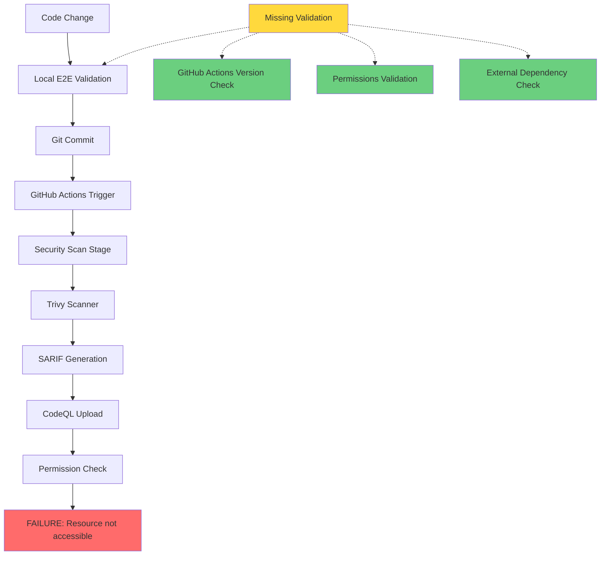

# CI/CD Failure Root Cause Analysis - 5 Whys Investigation

## Initial Failure
**Error**: CodeQL Action v2 deprecated, "Resource not accessible by integration" 

## 5 Whys Deep Dive

### Why #1: Why did the CI/CD pipeline fail?
**Answer**: The workflow uses deprecated `github/codeql-action/upload-sarif@v2` and lacks proper permissions for SARIF upload.

**Evidence**: 
- Error: "CodeQL Action major versions v1 and v2 have been deprecated"
- Error: "Resource not accessible by integration" (permissions issue)

### Why #2: Why are we using deprecated GitHub Actions?
**Answer**: Our local E2E validation doesn't check for deprecated GitHub Actions or validate workflow syntax with latest GitHub APIs.

**Evidence**: 
- Workflow validator exists but doesn't check for `github/codeql-action` deprecations
- Local validation focuses on code, not CI/CD infrastructure
- No integration with GitHub APIs to check action version compatibility

### Why #3: Why doesn't our validation catch GitHub Action deprecations?
**Answer**: Our validation system is code-centric, not infrastructure-centric. It validates application logic but not the CI/CD pipeline itself.

**Evidence**:
- `enhanced_e2e_validator.py` focuses on Python imports, tests, and application logic
- `workflow_validator.py` has limited deprecated action list (missing codeql-action)
- No automated checks against GitHub's deprecation announcements

### Why #4: Why is our validation system not comprehensive across all failure modes?
**Answer**: The validation system was designed for application code validation, not for full DevOps pipeline validation. There's a design gap between application validation and infrastructure validation.

**Evidence**:
- Validation focuses on application-layer issues
- Missing infrastructure-layer validation (GitHub Actions, permissions, API versions)
- No integration testing of actual CI/CD execution environments
- Local validation doesn't simulate GitHub Actions environment

### Why #5: Why do we have this architectural gap in validation coverage?
**Answer**: The system evolved incrementally focused on immediate code quality, without considering the full DevOps lifecycle. There's no holistic validation strategy covering code + infrastructure + permissions + external dependencies.

**Root Cause**: **Lack of holistic validation architecture that covers the entire CI/CD ecosystem**

## Multiple Hypotheses for Root Cause

### Hypothesis 1: Insufficient GitHub Actions Version Management
**Theory**: We lack automated tracking and validation of GitHub Action versions
**Test Plan**: 
1. Check all workflows for deprecated actions
2. Implement automated action version checking
3. Expected Outcome: Identify all version mismatches before deployment

### Hypothesis 2: Missing Permissions Validation 
**Theory**: SARIF upload requires specific repository permissions not validated locally
**Test Plan**:
1. Analyze required permissions for security scanning workflows
2. Implement permission validation in local tests
3. Expected Outcome: Catch permission issues before GitHub deployment

### Hypothesis 3: Gap Between Local and GitHub Environments
**Theory**: Local validation doesn't replicate GitHub Actions execution environment
**Test Plan**:
1. Run workflow validation using GitHub CLI or APIs
2. Simulate GitHub permissions locally
3. Expected Outcome: Exact match between local and remote validation

### Hypothesis 4: Incomplete External Dependency Tracking
**Theory**: We don't track external service changes (GitHub API updates, action deprecations)
**Test Plan**:
1. Implement external dependency monitoring
2. Add GitHub API change detection
3. Expected Outcome: Proactive notification of breaking changes

## Data Flow Analysis

## System Integration Points Analysis

1. **Code Layer**: ✅ Well validated (imports, syntax, tests)
2. **Application Layer**: ✅ Well validated (integration tests, e2e)
3. **Infrastructure Layer**: ❌ Poorly validated (workflow syntax, action versions)
4. **Permissions Layer**: ❌ Not validated (GitHub repository permissions)
5. **External Dependencies**: ❌ Not monitored (GitHub API changes, action deprecations)

## Failure Pattern Recognition

This failure represents a **broader pattern of validation gaps**:

### Similar Potential Issues:
1. **Docker base image deprecations** (not caught until deployment)
2. **Azure Functions runtime deprecations** (not validated locally)
3. **NPM package security vulnerabilities** (detected only in CI)
4. **Python dependency conflicts** in different environments
5. **GitHub secret/token expiration** (no proactive monitoring)

### Common Root Pattern:
**External dependency changes not validated in local development cycle**
