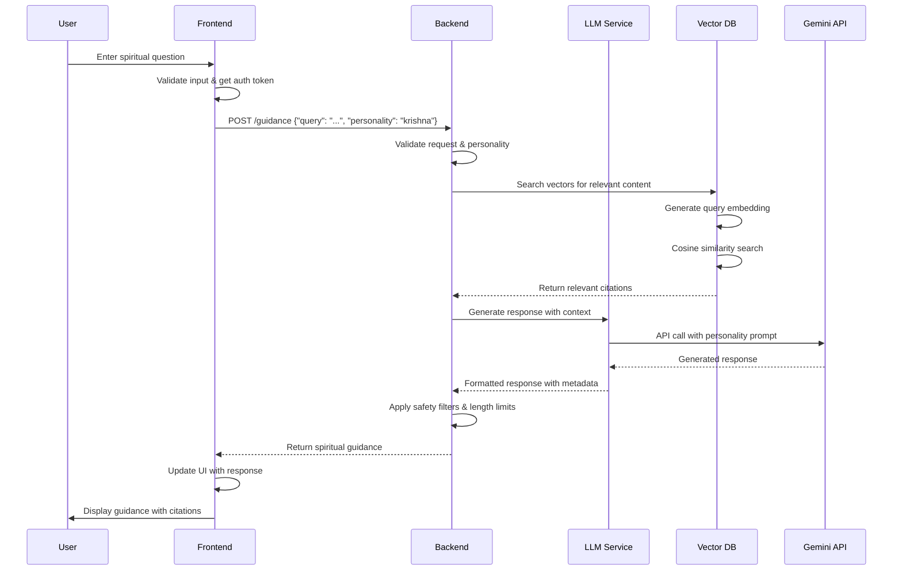
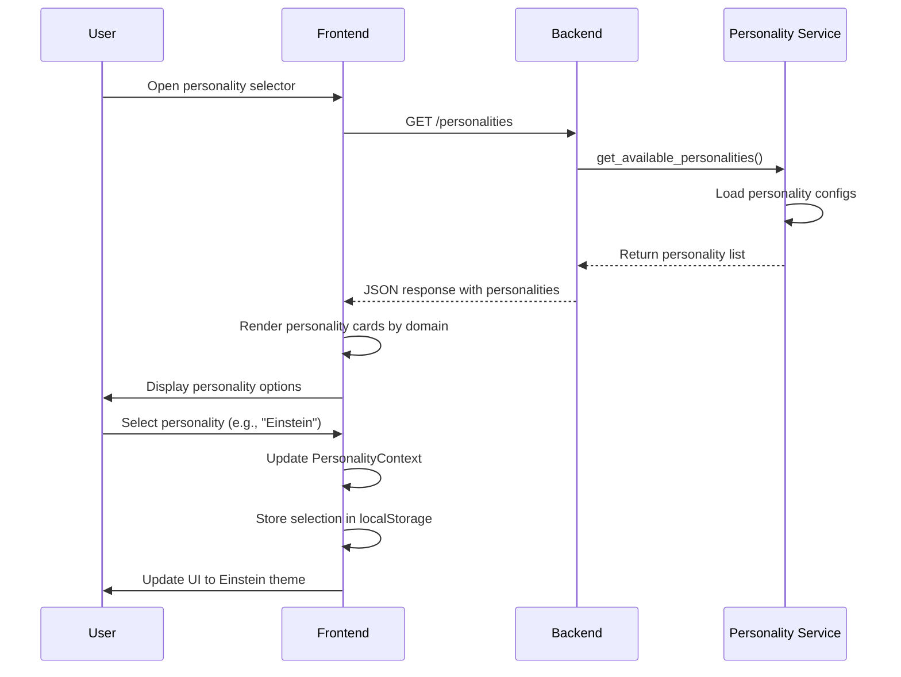
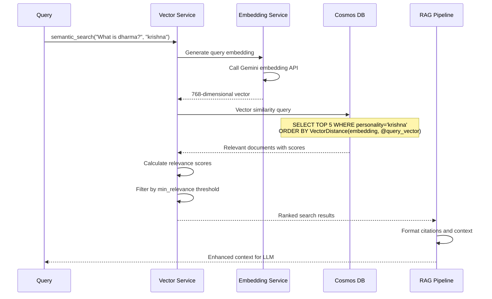
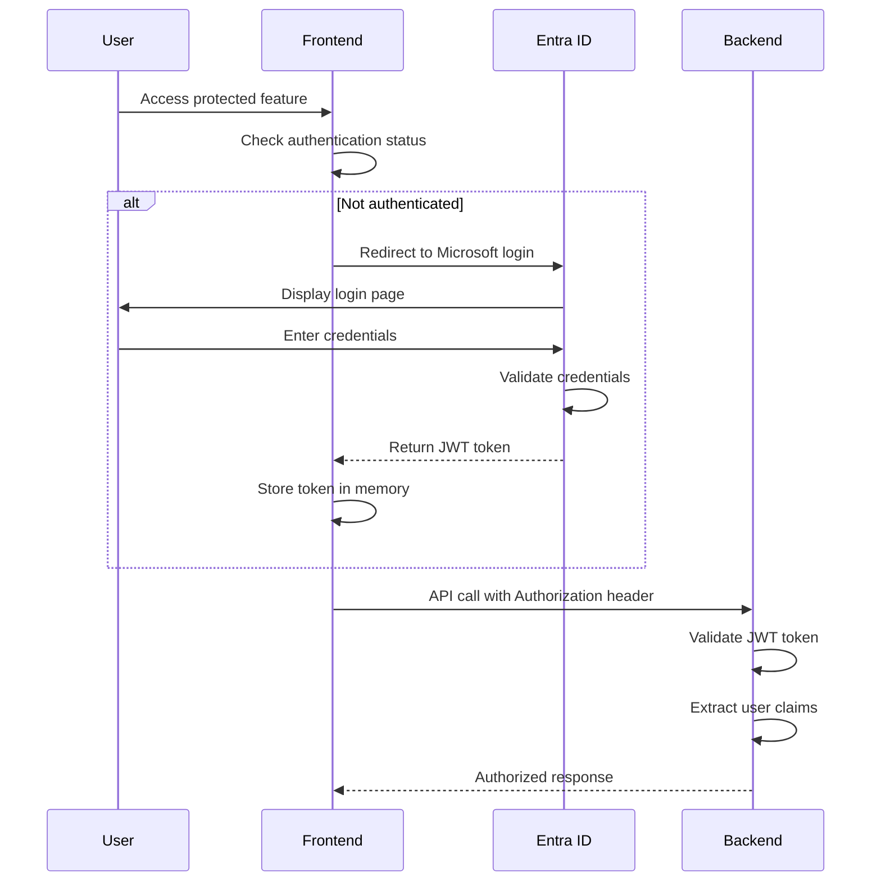
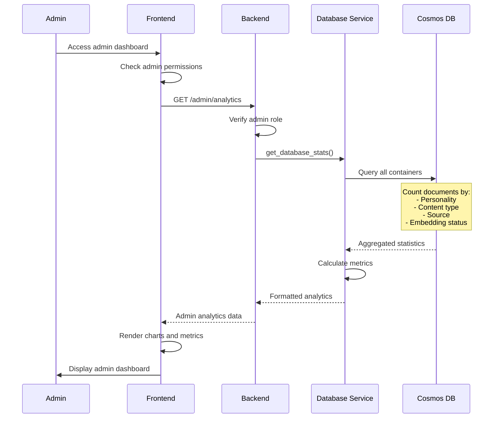
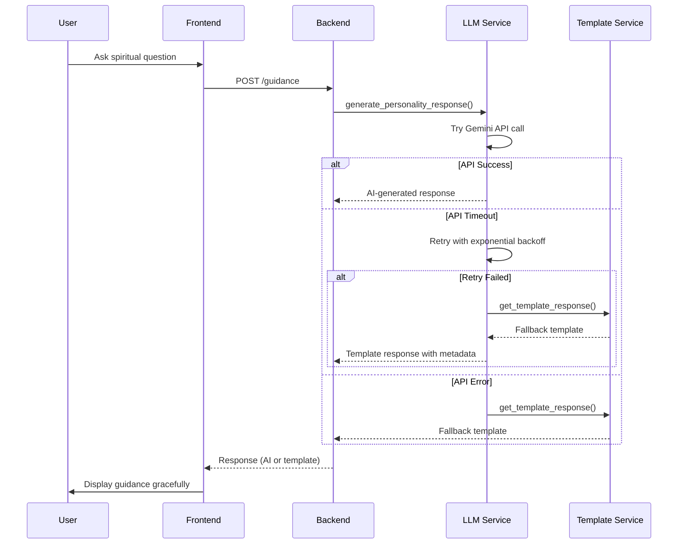

# Vimarsh Project Training Document
*Comprehensive Technical Guide for Junior Software Engineers*

**⚠️ IMPORTANT: This document distinguishes between implemented features and aspirational claims. See "Reality vs Aspirational Claims" section for honest assessment.**

---

## Table of Contents

1. [High-Level Introduction](#1-high-level-introduction)
2. [Detailed System Architecture](#2-detailed-system-architecture)
3. [Detailed Data Model](#3-detailed-data-model)
4. [Detailed Data Flow](#4-detailed-data-flow)
5. [Code Walkthrough](#5-code-walkthrough)
6. [Reality vs Aspirational Claims](#6-reality-vs-aspirational-claims)
7. [Refactor and Architectural Improvements](#7-refactor-and-architectural-improvements)
8. [Junior Engineer Quick Start Guide](#8-junior-engineer-quick-start-guide)

---

## 1. High-Level Introduction

### Purpose
Vimarsh is an **AI-powered spiritual guidance system** that provides personalized advice from Hindu sacred texts through multiple spiritual and philosophical personalities. The platform offers divine wisdom through an authentic AI representation of Lord Krishna alongside 11 other revered personalities from spiritual, scientific, historical, and philosophical domains.

### North Star
**"Make timeless wisdom accessible to everyone through AI-powered spiritual guidance that is authentic, contextual, and transformative."**

The vision is to democratize access to spiritual wisdom by leveraging modern AI technology while maintaining the authenticity and depth of traditional teachings.

### Value Proposition

**For Spiritual Seekers:**
- **Instant Access**: Get spiritual guidance 24/7 without waiting for human spiritual teachers
- **Multi-Perspective Wisdom**: Choose from 12 different personalities across 4 domains
- **Contextual Responses**: Receive guidance tailored to your specific life situations
- **Authentic Voice**: Experience wisdom delivered in the authentic voice of each personality
- **Citation Grounding**: Get references to original texts and teachings

**For Modern Practitioners:**
- **Accessible Format**: Ancient wisdom delivered through modern conversational AI
- **Progressive Enhancement**: System works gracefully even with partial deployments
- **Cross-Platform**: Web-based interface accessible on any device
- **Privacy-First**: No data retention, conversations are ephemeral

### Core Use Cases

1. **Daily Spiritual Guidance**
   - Morning meditation insights from Buddha
   - Ethical decision-making advice from Krishna
   - Leadership wisdom from Lincoln

2. **Life Challenge Support**
   - Relationship guidance from Jesus or Rumi
   - Career decisions from Einstein or Chanakya
   - Personal growth from Marcus Aurelius

3. **Learning and Exploration**
   - Understanding Bhagavad Gita teachings through Krishna
   - Scientific curiosity discussions with Einstein or Tesla
   - Philosophical exploration with Confucius or Lao Tzu

4. **Crisis and Emotional Support**
   - Compassionate guidance during difficult times
   - Perspective on suffering from Buddha
   - Stoic resilience from Marcus Aurelius

### Success Metrics
- **User Engagement**: Session duration, return visits, personality switching
- **Content Quality**: Expert review scores, user feedback ratings
- **System Reliability**: 99.9% uptime, < 3s response time
- **Cost Efficiency**: Serverless architecture keeping costs under $50/month

---

## 2. Detailed System Architecture

### Architecture Overview
Vimarsh implements a **serverless RAG (Retrieval Augmented Generation) pipeline** with a **multi-personality AI system** built on Azure cloud infrastructure.

```
┌─────────────────┐    ┌──────────────────┐    ┌─────────────────┐
│   React SPA     │    │  Azure Functions │    │  Azure Cosmos   │
│   (Frontend)    │◄──►│    (Backend)     │◄──►│      DB         │
│                 │    │                  │    │                 │
│ • TypeScript    │    │ • Python 3.12   │    │ • Document DB   │
│ • Microsoft     │    │ • RESTful APIs   │    │ • Vector Search │
│   Entra ID      │    │ • LLM Service    │    │ • Multi-persona │
│ • UI Components │    │ • RAG Pipeline   │    │   partitioning  │
└─────────────────┘    └──────────────────┘    └─────────────────┘
         │                       │                       │
         │              ┌────────▼────────┐             │
         │              │  Google Gemini  │             │
         └──────────────┤   2.5 Flash     │─────────────┘
                        │   AI Model      │
                        └─────────────────┘
```

### Technology Stack

**Frontend (React 18 + TypeScript)**
- **Framework**: React 18 with TypeScript for type safety
- **Authentication**: Microsoft Entra ID (multi-tenant support)
- **State Management**: React Context API + hooks
- **Styling**: CSS modules with BEM methodology
- **Build Tool**: Create React App with TypeScript template
- **Deployment**: Azure Static Web Apps

**Backend (Azure Functions + Python)**
- **Runtime**: Python 3.12 on Azure Functions v4
- **Architecture**: Modular service layer with graceful fallbacks
- **API Design**: RESTful endpoints with standardized error handling
- **Authentication**: Azure Entra ID integration
- **Monitoring**: Application Insights with custom telemetry

**AI/ML Layer**
- **Primary LLM**: Google Gemini 2.5 Flash for response generation
- **Embedding Model**: Gemini text-embedding-004 (768 dimensions)
- **RAG Pipeline**: Hybrid search with vector similarity + keyword matching
- **Personalities**: 12 pre-configured personalities with domain-specific templates

**Data Layer**
- **Primary Database**: Azure Cosmos DB (Serverless, single region)
- **Vector Storage**: Cosmos DB with native vector search capabilities
- **Partitioning Strategy**: Multi-personality hierarchical partitioning
- **Backup**: Automated point-in-time recovery

**Infrastructure**
- **IaC**: Bicep templates for unified resource deployment
- **Resource Strategy**: Single resource group (vimarsh-rg) for simplified management
- **Security**: Azure Key Vault for secrets management
- **Monitoring**: Application Insights + Azure Monitor

### Key Architectural Patterns

**1. Graceful Degradation**
```python
# Example from personality_service.py
try:
    # Try LLM service first
    llm_response = self._run_async_llm_call(query, personality_id)
    if llm_response and llm_response.content:
        return {"content": llm_response.content, ...}
except Exception:
    # Fallback to template response
    return {"content": self._get_template_response(personality_id), ...}
```

**2. Modular Service Architecture**
- Each service (LLM, Vector, Memory, Admin) is independently deployable
- Services have fallback mechanisms if dependencies are unavailable
- Configuration-driven feature toggles

**3. Progressive Enhancement**
- Core functionality works without advanced features
- RAG pipeline has fallback to simple template responses
- Authentication is optional for development

**4. Serverless-First Design**
- Consumption-based pricing for cost optimization
- Auto-scaling based on demand
- No infrastructure management overhead

### Security Architecture

**Authentication Flow:**
1. Frontend redirects to Microsoft Entra ID
2. User authenticates with Microsoft/personal account
3. JWT token returned to frontend
4. Backend validates JWT for protected endpoints

**Data Security:**
- All secrets stored in Azure Key Vault
- HTTPS-only communication
- No sensitive data in logs
- RBAC for resource access

**API Security:**
- CORS configuration for cross-origin requests
- Input validation and sanitization
- Rate limiting (planned)
- SQL injection prevention

---

## 3. Detailed Data Model

### Core Data Entities

#### 3.1 Personality Configuration
```python
@dataclass
class PersonalityConfig:
    id: str                    # "krishna", "einstein", etc.
    name: str                  # Display name
    domain: PersonalityDomain  # SPIRITUAL, SCIENTIFIC, HISTORICAL, PHILOSOPHICAL
    description: str           # User-facing description
    safety_level: SafetyLevel  # STRICT, MODERATE, MINIMAL
    max_response_length: int   # Character limit (300-500)
    greeting_style: str        # "beloved devotee", "my friend"
    tone_indicators: List[str] # Keywords for personality validation
```

**Current Personalities:**
- **Spiritual**: Krishna, Buddha, Jesus, Rumi
- **Scientific**: Einstein, Newton, Tesla
- **Historical**: Lincoln, Chanakya, Confucius
- **Philosophical**: Marcus Aurelius, Lao Tzu

#### 3.2 Vector Document Schema
```python
@dataclass
class VectorDocument:
    id: str                           # Unique document identifier
    content: str                      # Main text content
    personality: PersonalityType      # Associated personality
    content_type: ContentType         # VERSE, COMMENTARY, COMPLETE, TEACHING
    source: str                       # Original source reference
    title: Optional[str]              # Document title
    chapter: Optional[str]            # Chapter reference
    verse: Optional[str]              # Verse number
    sanskrit: Optional[str]           # Original Sanskrit text
    translation: Optional[str]        # English translation
    citation: Optional[str]           # Formatted citation
    category: str = "general"         # Content category
    language: str = "English"         # Content language
    embedding: Optional[List[float]]  # 768-dimensional vector
    embedding_model: str              # Model used for embedding
    relevance_score: float = 0.0      # Similarity score
    created_at: str                   # ISO timestamp
    updated_at: str                   # ISO timestamp
    metadata: Dict[str, Any]          # Additional metadata
```

#### 3.3 Conversation Model
```python
@dataclass
class ConversationMessage:
    id: str                    # Message ID
    conversation_id: str       # Parent conversation
    user_id: str              # User identifier
    personality_id: str       # Active personality
    user_message: str         # User input
    ai_response: str          # AI response
    response_metadata: dict   # Response generation metadata
    timestamp: str            # ISO timestamp
    feedback_score: Optional[int]  # User rating (1-5)
    
@dataclass
class Conversation:
    id: str                    # Conversation ID
    user_id: str              # User identifier
    personality_id: str       # Primary personality
    messages: List[ConversationMessage]
    started_at: str           # ISO timestamp
    last_active: str          # ISO timestamp
    is_active: bool = True    # Conversation status
```

### Database Schema (Azure Cosmos DB)

#### 3.4 Database Structure
```
vimarsh-db/
├── conversations/           # User conversations
│   ├── partition_key: user_id
│   └── documents: Conversation objects
├── feedback/               # User feedback
│   ├── partition_key: conversation_id
│   └── documents: Feedback objects
├── spiritual_content/      # RAG content
│   ├── partition_key: category
│   └── documents: Content objects
└── personality_vectors/    # Vector embeddings
    ├── partition_key: personality
    └── documents: VectorDocument objects
```

#### 3.5 Vector Database Partitioning Strategy
```
Hierarchical Partitioning:
/personality_id/content_type/source

Examples:
- /krishna/verse/bhagavad_gita
- /einstein/quote/relativity_papers  
- /lincoln/speech/presidential_addresses

Benefits:
- Efficient personality-specific queries
- Better query performance
- Logical data organization
- Simplified backup/restore
```

#### 3.6 Memory System (Phase 2)
```python
@dataclass
class ConversationMemory:
    user_id: str
    personality_id: str
    key_insights: List[str]      # Important revelations
    recurring_themes: List[str]  # Pattern recognition
    spiritual_progress: dict     # Growth tracking
    preference_profile: dict     # User preferences
    context_summary: str         # Session summary

@dataclass
class WisdomJournal:
    user_id: str
    entries: List[dict]          # Journal entries
    insights: List[str]          # Extracted insights
    growth_milestones: List[dict] # Progress markers
    reflection_prompts: List[str] # Suggested reflections
```

### Data Relationships

**One-to-Many Relationships:**
- User → Conversations (1:N)
- Conversation → Messages (1:N)
- Personality → VectorDocuments (1:N)

**Many-to-Many Relationships:**
- Users ↔ Personalities (through conversations)
- VectorDocuments ↔ ContentTypes (through metadata)

**Lookup Tables:**
- PersonalityConfigs (static configuration)
- ContentTypeDefinitions (static types)
- SourceMappings (content source metadata)

---

## 4. Detailed Data Flow

### 4.1 Core User Interaction Flow



### 4.2 Personality Selection Flow



### 4.3 Vector Search & RAG Pipeline



### 4.4 Authentication Flow



### 4.5 Admin Analytics Flow



### 4.6 Error Handling & Fallback Flow



---

## 6. Reality vs Aspirational Claims

### 6.1 Current Implementation vs Documentation Claims

**⚠️ CRITICAL: Understanding Fallback Philosophy**

Vimarsh follows a **"degradation to templates rather than failure"** philosophy. This means:
- Templates are **heavily used in practice**, not just fallbacks
- Many "enhanced" services are **conditional/optional**
- The system **works gracefully** even with partial deployments

#### Honest Service Status Assessment

| Feature/Claim | Actual Implementation | Reality Check | Impact |
|---------------|----------------------|---------------|---------|
| **Persistent Memory** | Partial (in-memory + optional DB) | In-memory sessions with conditional persistence | ⚠️ **Medium** - Memory doesn't persist across deployments |
| **Universal Citation Grounding** | Only when citation checker imported | Conditional feature, not always active | ⚠️ **Medium** - Citations may not be validated |
| **Dynamic LLM Responses** | Template fallback common | Templates used frequently in practice | ⚠️ **High** - Users often get templates, not AI |
| **Full Auth Protection** | Guidance endpoint open | Core guidance accessible without auth | ⚠️ **Low** - By design for accessibility |
| **Rich Admin Analytics** | Mostly fallback static data | Limited real-time analytics | ⚠️ **Low** - Admin features are supplementary |
| **Hybrid Search Always Active** | Conditional import | Enhanced RAG only when services available | ⚠️ **Medium** - Search quality varies by deployment |

### 6.2 Fallback Patterns in Practice

#### Template Response Usage
```python
# Reality: This happens frequently, not rarely
try:
    llm_response = self._run_async_llm_call(query, personality_id)
    # Often fails due to API limits, timeouts, or configuration issues
except Exception:
    # COMMON PATH: Template responses are regularly used
    return self._get_template_response(personality_id)
```

#### Service Availability Detection
```python
# Pattern used throughout the codebase
try:
    from services.enhanced_rag_service import EnhancedRAGService
    enhanced_rag = EnhancedRAGService()
    SERVICES_LOADED["enhanced_rag"] = True
except ImportError:
    # FREQUENT: Enhanced services often unavailable
    enhanced_rag = None
    SERVICES_LOADED["enhanced_rag"] = False
```

### 6.3 Debugging Common Issues

#### "Template Only" Responses
**Symptom**: All responses seem scripted/identical
**Cause**: LLM service import failure or API configuration issue
**Check**: `/api/health` endpoint shows `llm_service: false`
**Solution**: Verify `GEMINI_API_KEY` environment variable

#### Empty Vector Search Results
**Symptom**: No relevant context found for queries
**Cause**: Cosmos DB connection issues or missing embeddings
**Check**: Health endpoint shows `vector_search: false`
**Solution**: Verify `AZURE_COSMOS_CONNECTION_STRING`

#### Memory Not Persisting
**Symptom**: Conversations don't remember previous context
**Cause**: Memory service running in-memory only mode
**Check**: Health endpoint shows `memory_persistence: false`
**Solution**: Database service needs to be properly configured

### 6.4 Capability Manifest

**Proposed Enhancement**: Add capability detection to health endpoint
```python
@app.route(route="health", methods=["GET"])
def health_check(req: func.HttpRequest) -> func.HttpResponse:
    capabilities = {
        "llm_service": bool(llm_service and llm_service.is_configured),
        "vector_search": bool(vector_service and vector_service.container),
        "memory_persistence": bool(memory_service and db_available),
        "citation_grounding": bool(citation_checker),
        "enhanced_rag": bool(enhanced_rag_service),
        "authentication": bool(auth_service)
    }
    
    return func.HttpResponse(json.dumps({
        "status": "healthy",
        "timestamp": datetime.utcnow().isoformat(),
        "capabilities": capabilities,
        "fallback_modes": {
            "templates": "Always available",
            "simple_rag": "Basic text search",
            "static_responses": "Hardcoded personality responses"
        },
        "deployment_readiness": calculate_deployment_readiness(capabilities)
    }))
```

### 6.5 Setting Realistic Expectations

#### For New Engineers
1. **Expect Templates**: Template responses are normal, not failures
2. **Check Health Endpoint**: Always verify which services are actually available
3. **Understand Fallbacks**: The system is designed to degrade gracefully
4. **Service Independence**: Each service should work without others

#### For Users
1. **Response Variation**: Quality depends on available services
2. **Gradual Enhancement**: More features become available as services deploy
3. **Consistent Experience**: Core functionality always works

### 6.6 Immediate Action Items

#### High Priority (Next Sprint)
- [ ] **Add Capability Manifest**: Expose service availability in health endpoint
- [ ] **Update Frontend**: Show users which features are currently available
- [ ] **Service Status UI**: Admin dashboard showing real service status
- [ ] **Documentation Alignment**: Update README to match actual capabilities

#### Medium Priority (Next Month)
- [ ] **Enhanced Fallback Indicators**: Show users when they're getting template vs AI responses
- [ ] **Service Recovery**: Auto-retry failed service initializations
- [ ] **Performance Monitoring**: Track template vs AI response ratios
- [ ] **User Education**: Help text explaining system capabilities

---

## 7. Refactor and Architectural Improvements

## 5. Code Walkthrough

### 5.1 Backend Architecture

#### Main Application Entry Point (`function_app.py`)
```python
# Core Azure Functions app with modular service imports
app = func.FunctionApp(http_auth_level=func.AuthLevel.ANONYMOUS)

# Graceful service initialization with fallbacks
try:
    from services.personality_service import PersonalityService
    personality_service = PersonalityService()
    SERVICES_LOADED["personality"] = True
except ImportError as e:
    logger.warning(f"Personality service not available: {e}")
    personality_service = None

# Health check endpoint for monitoring
@app.route(route="health", methods=["GET"])
def health_check(req: func.HttpRequest) -> func.HttpResponse:
    return func.HttpResponse(
        json.dumps({
            "status": "healthy",
            "timestamp": datetime.utcnow().isoformat(),
            "services": SERVICES_LOADED
        }),
        mimetype="application/json"
    )
```

**Key Features:**
- **Graceful Service Loading**: Services load independently with fallbacks
- **Health Monitoring**: Comprehensive health checks for all components
- **Error Handling**: Structured error responses with proper HTTP status codes
- **CORS Configuration**: Cross-origin support for frontend integration

#### LLM Service (`services/llm_service.py`)
```python
class LLMService:
    def __init__(self):
        self.api_key = os.environ.get('GEMINI_API_KEY')
        self.is_configured = bool(self.api_key)
        
        if self.is_configured:
            genai.configure(api_key=self.api_key)
            self.model = genai.GenerativeModel('gemini-1.5-flash')
            
        self._initialize_personalities()
    
    async def generate_personality_response(
        self, query: str, personality_id: str
    ) -> SpiritualResponse:
        """Generate response with retry logic and timeout handling"""
        
        config = self.personalities[personality_id]
        prompt = config.prompt_template.format(query=query)
        
        # Retry logic with exponential backoff
        for attempt in range(config.max_retries + 1):
            try:
                response = await asyncio.wait_for(
                    self._generate_gemini_response(prompt),
                    timeout=config.timeout_seconds
                )
                
                if response and response.text:
                    # Enforce character limits
                    response_text = response.text.strip()
                    if len(response_text) > config.max_chars:
                        response_text = response_text[:config.max_chars-3] + "..."
                    
                    return SpiritualResponse(
                        content=response_text,
                        personality_id=personality_id,
                        source=f"gemini_api_{personality_id}_optimized",
                        character_count=len(response_text),
                        max_allowed=config.max_chars
                    )
            except asyncio.TimeoutError:
                # Progressive backoff on retry
                await asyncio.sleep(1 * (attempt + 1))
```

**Key Features:**
- **12 Personality Configurations**: Each with domain-specific prompts and constraints
- **Timeout Management**: Per-personality timeout configuration
- **Retry Logic**: Exponential backoff for API failures
- **Character Limits**: Enforced response length limits
- **Fallback Responses**: Graceful degradation to templates

#### Vector Database Service (`services/vector_database_service.py`)
```python
class VectorDatabaseService:
    def __init__(self):
        self.cosmos_db_name = "vimarsh-multi-personality"
        self.container_name = "personality_vectors"
        self.partition_strategy = "hierarchical"
        
        self._initialize_cosmos_db()
        self._initialize_embedding_model()
    
    async def semantic_search(
        self, query: str, personality: Optional[PersonalityType] = None,
        content_types: Optional[List[ContentType]] = None,
        top_k: int = 5, min_relevance: float = 0.1
    ) -> List[SearchResult]:
        """Semantic search with personality filtering"""
        
        # Generate query embedding
        query_embedding = self.embedding_model.encode(query)
        
        # Build filtered query
        sql_query = "SELECT * FROM c"
        conditions = []
        
        if personality:
            conditions.append(f"c.personality = '{personality.value}'")
        if content_types:
            type_values = [f"'{ct.value}'" for ct in content_types]
            conditions.append(f"c.content_type IN ({', '.join(type_values)})")
        
        if conditions:
            sql_query += f" WHERE {' AND '.join(conditions)}"
        
        # Execute search and calculate similarities
        items = list(self.container.query_items(
            query=sql_query, enable_cross_partition_query=True
        ))
        
        # Rank by cosine similarity
        results = []
        for item in items:
            similarity = np.dot(doc_embedding, query_embedding) / (
                np.linalg.norm(doc_embedding) * np.linalg.norm(query_embedding)
            )
            if similarity >= min_relevance:
                results.append(SearchResult(...))
        
        return sorted(results, key=lambda x: x.relevance_score, reverse=True)[:top_k]
```

**Key Features:**
- **Multi-Personality Partitioning**: Efficient personality-specific queries
- **Vector Similarity Search**: Cosine similarity with configurable thresholds
- **Hybrid Filtering**: Combine semantic search with metadata filters
- **Hierarchical Partitioning**: Optimized query performance

### 5.2 Frontend Architecture

#### Main App Component (`App.tsx`)
```typescript
function App() {
  return (
    <MsalProvider instance={msalInstance}>
      <PersonalityProvider>
        <AdminProvider>
          <div className="App">
            <Header />
            <Routes>
              <Route path="/" element={<GuidanceInterface />} />
              <Route path="/admin" element={
                <RequireAuth>
                  <AdminDashboard />
                </RequireAuth>
              } />
            </Routes>
          </div>
        </AdminProvider>
      </PersonalityProvider>
    </MsalProvider>
  );
}
```

#### Guidance Interface (`components/GuidanceInterface.tsx`)
```typescript
export const GuidanceInterface: React.FC = () => {
  const { selectedPersonality, setSelectedPersonality, personalities } = usePersonalityContext();
  const { instance, accounts } = useMsal();
  const [messages, setMessages] = useState<Message[]>([]);
  const [inputValue, setInputValue] = useState('');
  const [isLoading, setIsLoading] = useState(false);
  
  const handleSendMessage = async () => {
    if (!inputValue.trim() || isLoading) return;
    
    const userMessage: Message = {
      id: Date.now().toString(),
      content: inputValue,
      sender: 'user',
      timestamp: new Date()
    };
    
    setMessages(prev => [...prev, userMessage]);
    setIsLoading(true);
    
    try {
      const response = await guidanceService.getGuidance(
        inputValue,
        selectedPersonality?.id || 'krishna'
      );
      
      const aiMessage: Message = {
        id: (Date.now() + 1).toString(),
        content: response.content,
        sender: 'ai',
        timestamp: new Date(),
        personality: selectedPersonality,
        metadata: response.metadata
      };
      
      setMessages(prev => [...prev, aiMessage]);
    } catch (error) {
      // Error handling with user-friendly fallback
      const errorMessage: Message = {
        id: (Date.now() + 1).toString(),
        content: "I apologize, but I'm having difficulty responding right now. Please try again.",
        sender: 'ai',
        timestamp: new Date(),
        isError: true
      };
      setMessages(prev => [...prev, errorMessage]);
    } finally {
      setIsLoading(false);
      setInputValue('');
    }
  };
```

**Key Features:**
- **Real-time Chat Interface**: Message history with personality context
- **Error Handling**: Graceful error states with user feedback
- **Loading States**: Visual feedback during API calls
- **Responsive Design**: Mobile-first responsive layout

#### Authentication Configuration (`config/authIds.ts`)
```typescript
const CLIENT_ID_MAP = {
  production: {
    clientId: 'e4bd74b8-9a82-40c6-8d52-3e231733095e',
    tenantId: '80fe68b7-105c-4fb9-ab03-c9a818e35848',
    environment: 'multitenant-production',
    accountType: 'multitenant-personal'
  },
  development: {
    clientId: 'e4bd74b8-9a82-40c6-8d52-3e231733095e',
    tenantId: '80fe68b7-105c-4fb9-ab03-c9a818e35848',
    environment: 'multitenant-development',
    accountType: 'multitenant-personal'
  }
};

export const getClientId = (): string => {
  if (process.env.REACT_APP_CLIENT_ID) {
    return process.env.REACT_APP_CLIENT_ID;
  }
  
  return process.env.NODE_ENV === 'production' 
    ? CLIENT_ID_MAP.production.clientId 
    : CLIENT_ID_MAP.development.clientId;
};
```

**Key Features:**
- **Environment-Based Configuration**: Automatic client ID selection
- **Multi-tenant Support**: Supports Microsoft accounts and personal accounts
- **Validation**: GUID format validation for client IDs
- **Security**: Environment variable override for production

### 5.3 Infrastructure as Code

#### Main Deployment Template (`infrastructure/main.bicep`)
```bicep
targetScope = 'subscription'

@description('Location for all resources - single region deployment')
param location string = 'West US 2'

@secure()
param geminiApiKey string

// Unified Resource Group for simplified management
resource vimarshResourceGroup 'Microsoft.Resources/resourceGroups@2023-07-01' = {
  name: 'vimarsh-rg'
  location: location
  tags: {
    project: 'vimarsh'
    costStrategy: 'unified'
    environment: 'production'
    purpose: 'spiritual-guidance-platform'
  }
}

// Deploy all resources in unified group
module vimarshResources 'unified-resources.bicep' = {
  name: 'vimarsh-unified-deployment'
  scope: vimarshResourceGroup
  params: {
    location: location
    geminiApiKey: geminiApiKey
    expertReviewEmail: expertReviewEmail
  }
}
```

#### Unified Resources (`infrastructure/unified-resources.bicep`)
```bicep
// Cosmos DB with Vector Search capabilities
resource cosmosDb 'Microsoft.DocumentDB/databaseAccounts@2023-04-15' = {
  name: cosmosDbName
  location: location
  kind: 'GlobalDocumentDB'
  properties: {
    databaseAccountOfferType: 'Standard'
    consistencyPolicy: {
      defaultConsistencyLevel: 'Session'
    }
    locations: [
      {
        locationName: location
        failoverPriority: 0
      }
    ]
    capabilities: [
      {
        name: 'EnableServerless'  // Cost optimization
      }
    ]
  }
}

// Function App with comprehensive configuration
resource functionApp 'Microsoft.Web/sites@2023-01-01' = {
  name: functionAppName
  location: 'eastus'
  kind: 'functionapp,linux'
  properties: {
    serverFarmId: hostingPlan.id
    reserved: true
    siteConfig: {
      linuxFxVersion: 'Python|3.12'
      appSettings: [
        {
          name: 'GEMINI_API_KEY'
          value: '@Microsoft.KeyVault(VaultName=${keyVault.name};SecretName=GEMINI-API-KEY)'
        }
        // ... other configuration
      ]
    }
  }
  identity: {
    type: 'SystemAssigned'
  }
}
```

**Key Features:**
- **Serverless Architecture**: Consumption-based pricing for cost optimization
- **Single Resource Group**: Simplified management and deployment
- **Security**: Key Vault integration for secrets
- **Monitoring**: Application Insights for observability

---

## 6. Refactor and Architectural Improvements

### 6.1 Current Technical Debt

#### High Priority Issues
1. **Test Coverage**: 247 failing tests in CI/CD pipeline
   - Missing unit tests for core services
   - Integration tests need implementation
   - E2E testing pipeline required

2. **Import Dependencies**: `backend/fix_imports.py` indicates import resolution issues
   - Circular import dependencies in services
   - Inconsistent relative/absolute import patterns
   - Missing `__init__.py` files in some modules

3. **Legacy Components**: Outdated components need removal
   - `frontend/src/components/ConversationInterface-old.tsx`
   - Multiple backup files cluttering codebase
   - Unused validation scripts in main directory

#### Medium Priority Issues
1. **LLM Integration**: Currently using placeholder responses
   - Gemini 2.5 Flash integration incomplete
   - Rate limiting not implemented
   - API error handling needs improvement

2. **RAG Pipeline**: Vector database queries not fully implemented
   - Static responses instead of dynamic retrieval
   - Citation grounding system incomplete
   - Performance optimization needed

### 6.2 Performance Optimizations

#### Backend Performance
```python
# Current: Synchronous LLM calls
def generate_response(query, personality):
    response = gemini_api.generate(query)
    return response

# Proposed: Async with connection pooling
async def generate_response(query, personality):
    async with aiohttp.ClientSession() as session:
        response = await session.post(gemini_endpoint, json={...})
    return response
```

#### Frontend Performance
```typescript
// Current: Re-render on every state change
const PersonalitySelector = () => {
  const personalities = usePersonalityContext();
  return personalities.map(p => <PersonalityCard key={p.id} {...p} />);
};

// Proposed: Memoized components
const PersonalitySelector = React.memo(() => {
  const personalities = usePersonalityContext();
  return personalities.map(p => 
    <MemoizedPersonalityCard key={p.id} {...p} />
  );
});
```

#### Database Optimization
```sql
-- Current: Cross-partition queries
SELECT * FROM c WHERE c.personality = 'krishna'

-- Proposed: Partition-aware queries  
SELECT * FROM c 
WHERE c.personality = 'krishna' 
  AND c.partition_key = 'krishna'
ORDER BY VectorDistance(c.embedding, @query_vector)
```

### 6.3 Scalability Improvements

#### 1. Caching Strategy
```python
# Implement Redis cache for frequent queries
@cached(ttl=300, key_func=lambda query, personality: f"{personality}:{hash(query)}")
async def get_cached_response(query: str, personality: str):
    return await llm_service.generate_response(query, personality)
```

#### 2. Rate Limiting
```python
# Add rate limiting per user/IP
@rate_limit(requests=100, window=3600)  # 100 requests per hour
async def guidance_endpoint(req: func.HttpRequest):
    user_id = get_user_id(req)
    return await process_guidance_request(req)
```

#### 3. Connection Pooling
```python
# Implement connection pooling for Cosmos DB
class CosmosConnectionPool:
    def __init__(self, connection_string: str, pool_size: int = 10):
        self.pool = ConnectionPool(connection_string, pool_size)
    
    async def get_connection(self):
        return await self.pool.acquire()
```

### 6.4 Maintainability Improvements

#### 1. Configuration Management
```python
# Current: Hardcoded configuration
class LLMService:
    def __init__(self):
        self.timeout = 30  # Hardcoded
        self.max_retries = 2  # Hardcoded

# Proposed: Environment-driven configuration
@dataclass
class LLMConfig:
    timeout: int = int(os.getenv('LLM_TIMEOUT', '30'))
    max_retries: int = int(os.getenv('LLM_MAX_RETRIES', '2'))
    model_name: str = os.getenv('LLM_MODEL', 'gemini-1.5-flash')

class LLMService:
    def __init__(self, config: LLMConfig):
        self.config = config
```

#### 2. Error Handling Standardization
```python
# Proposed: Centralized error handling
class VimarshException(Exception):
    def __init__(self, message: str, error_code: str, details: dict = None):
        self.message = message
        self.error_code = error_code
        self.details = details or {}

def error_handler(func):
    @functools.wraps(func)
    async def wrapper(*args, **kwargs):
        try:
            return await func(*args, **kwargs)
        except VimarshException:
            raise
        except Exception as e:
            logger.error(f"Unexpected error in {func.__name__}: {e}")
            raise VimarshException(
                "Internal service error",
                "INTERNAL_ERROR",
                {"original_error": str(e)}
            )
    return wrapper
```

#### 3. Monitoring and Observability
```python
# Proposed: Comprehensive telemetry
class TelemetryService:
    def __init__(self, app_insights_key: str):
        self.client = TelemetryClient(app_insights_key)
    
    def track_guidance_request(self, personality: str, query_length: int, 
                              response_time: float, source: str):
        self.client.track_event('guidance_request', {
            'personality': personality,
            'query_length': query_length,
            'response_time': response_time,
            'source': source
        })
    
    def track_error(self, error: VimarshException, context: dict):
        self.client.track_exception(error, properties=context)
```

### 6.5 Security Enhancements

#### 1. Input Validation
```python
# Proposed: Comprehensive input validation
from pydantic import BaseModel, validator

class GuidanceRequest(BaseModel):
    query: str
    personality_id: str
    user_id: Optional[str] = None
    
    @validator('query')
    def validate_query(cls, v):
        if not v or len(v.strip()) == 0:
            raise ValueError('Query cannot be empty')
        if len(v) > 1000:
            raise ValueError('Query too long')
        return v.strip()
    
    @validator('personality_id')
    def validate_personality(cls, v):
        if v not in VALID_PERSONALITIES:
            raise ValueError('Invalid personality')
        return v
```

#### 2. Content Safety
```python
# Proposed: Content safety service
class ContentSafetyService:
    def __init__(self):
        self.safety_filters = [
            'harmful_content',
            'inappropriate_spiritual_advice',
            'personal_information_disclosure'
        ]
    
    async def validate_response(self, response: str) -> tuple[bool, list[str]]:
        violations = []
        for filter_type in self.safety_filters:
            if await self._check_filter(response, filter_type):
                violations.append(filter_type)
        
        is_safe = len(violations) == 0
        return is_safe, violations
```

### 6.6 Cost Optimization

#### 1. Resource Management
```bicep
// Proposed: Auto-scaling and cost controls
resource functionApp 'Microsoft.Web/sites@2023-01-01' = {
  properties: {
    siteConfig: {
      functionAppScaleLimit: 10  // Limit concurrent executions
      dailyMemoryTimeQuota: 400000  // Daily execution limit
    }
  }
}

// Cost monitoring alerts
resource costAlert 'Microsoft.Insights/metricAlerts@2018-03-01' = {
  properties: {
    criteria: {
      allOf: [
        {
          metricName: 'TotalCost'
          operator: 'GreaterThan'
          threshold: 50  // Alert at $50/month
        }
      ]
    }
  }
}
```

#### 2. Caching for Cost Reduction
```python
# Cache expensive LLM calls
@lru_cache(maxsize=1000)
def get_template_response(personality_id: str, query_hash: str) -> str:
    return PERSONALITY_TEMPLATES[personality_id]

# Cache vector searches
async def cached_vector_search(query: str, personality: str):
    cache_key = f"vector:{personality}:{hash(query)}"
    cached = await redis_client.get(cache_key)
    if cached:
        return json.loads(cached)
    
    result = await vector_service.search(query, personality)
    await redis_client.setex(cache_key, 3600, json.dumps(result))
    return result
```

---

## 8. Junior Engineer Quick Start Guide

### 8.1 Understanding the Fallback Philosophy

**MOST IMPORTANT CONCEPT**: Vimarsh is designed with **graceful degradation** as a core principle. This means:

#### What You'll Actually Encounter
- **Template responses are normal**: Don't be surprised when responses seem templated
- **Service availability varies**: Not all features work in every deployment
- **Progressive enhancement**: Features become available as services are configured
- **Health endpoint is crucial**: Always check `/api/health` to see what's available

#### Common Misconceptions for New Engineers
❌ **Wrong**: "All responses should be AI-generated"  
✅ **Correct**: "Templates are the reliable fallback, AI is the enhancement"

❌ **Wrong**: "If citation grounding isn't working, something is broken"  
✅ **Correct**: "Citation grounding is optional and may not be available"

❌ **Wrong**: "Memory should always persist"  
✅ **Correct**: "Memory has in-memory mode and optional persistence"

### 8.2 Development Environment Setup

#### Prerequisites
```bash
# Required software versions
node --version    # v18+ required
python --version  # v3.12+ required
az --version      # Azure CLI for deployment
```

#### Clone and Setup
```bash
# 1. Clone repository
git clone https://github.com/vedprakash-m/vimarsh.git
cd vimarsh

# 2. Backend setup
cd backend
python -m venv venv
source venv/bin/activate  # On Windows: venv\Scripts\activate
pip install -r requirements.txt

# 3. Frontend setup
cd ../frontend
npm install

# 4. Environment configuration
cp .env.example .env.local
# Edit .env.local with your API keys
```

#### Local Development
```bash
# Terminal 1: Backend (Azure Functions)
cd backend
func host start

# Terminal 2: Frontend (React)
cd frontend
npm start

# Access application at http://localhost:3000
```

#### First Steps: Understanding Current State
```bash
# 1. Check what services are available
curl http://localhost:7071/api/health

# 2. Test basic guidance (will likely be template)
curl -X POST http://localhost:7071/api/guidance \
  -H "Content-Type: application/json" \
  -d '{"query": "What is dharma?", "personality_id": "krishna"}'

# 3. Check if you get template or AI response
# Look for "response_source" in metadata
```

### 8.3 Understanding Service Architecture

#### Service Loading Pattern
Every service follows this pattern:
```python
# This is the standard pattern throughout the codebase
try:
    from services.some_service import SomeService
    some_service = SomeService()
    SERVICES_LOADED["some_service"] = True
    logger.info("✅ SomeService loaded successfully")
except ImportError as e:
    logger.warning(f"⚠️ SomeService not available: {e}")
    some_service = None
    SERVICES_LOADED["some_service"] = False
```

#### Debugging Service Issues
```python
# Always check this first when debugging
def debug_service_status():
    print("🔍 Current service status:")
    for service, status in SERVICES_LOADED.items():
        icon = "✅" if status else "❌"
        print(f"  {icon} {service}: {status}")
```

### 8.4 Common Development Tasks

#### Understanding Response Sources
```python
# When debugging responses, always check the source
def analyze_response(response_data):
    metadata = response_data.get('metadata', {})
    source = metadata.get('response_source', 'unknown')
    
    if 'template' in source:
        print("⚠️ Template response - LLM service unavailable")
    elif 'gemini' in source:
        print("✅ AI-generated response")
    elif 'fallback' in source:
        print("⚠️ Fallback response - something failed")
```

#### Adding a New Personality (Reality Check)
```python
# 1. Add to personality_models.py (always works)
"new_personality": PersonalityConfig(
    id="new_personality",
    name="New Personality",
    domain=PersonalityDomain.SPIRITUAL,
    description="Description",
    safety_level=SafetyLevel.MODERATE,
    max_response_length=400,
    greeting_style="dear friend",
    tone_indicators=["keyword1", "keyword2"]
)

# 2. Add template response (CRITICAL - this ensures it works even without AI)
def _load_response_templates(self):
    return {
        # ... existing templates ...
        "new_personality": "Template response for new personality..."
    }

# 3. Add LLM configuration (optional, only works if LLM service available)
"new_personality": PersonalityConfig(
    # ... config from step 1 ...
    prompt_template="""You are [Personality]. 
    RESPONSE REQUIREMENTS: Maximum 400 characters...
    USER QUERY: {query}
    Response:"""
)
```

### 8.5 Testing and Validation

#### Testing Fallback Behavior
```python
# Test that your changes work without enhanced services
def test_fallback_mode():
    # Simulate service unavailable
    original_llm = personality_service._llm_service
    personality_service._llm_service = None
    
    response = personality_service.generate_response(
        "Test query", "your_personality"
    )
    
    assert response["content"] is not None
    assert "template" in response["metadata"]["response_source"]
    
    # Restore service
    personality_service._llm_service = original_llm
```

#### Common Test Patterns
```python
def test_service_graceful_degradation():
    """Test that services work with missing dependencies"""
    # This is the most important test pattern in Vimarsh
    pass

def test_with_and_without_services():
    """Test functionality both with services available and unavailable"""
    pass

def test_capability_detection():
    """Test that health endpoint correctly reports service status"""
    pass
```

### 8.6 Debugging Decision Tree

#### Issue: "All responses look the same"
1. ✅ **Check**: `GET /api/health` - is `llm_service: true`?
2. ❌ **If false**: Check `GEMINI_API_KEY` environment variable
3. ✅ **If true**: Check response metadata for `response_source`
4. **If template**: This is normal fallback behavior

#### Issue: "No context in responses"
1. ✅ **Check**: `GET /api/health` - is `vector_search: true`?
2. ❌ **If false**: Check Cosmos DB connection string
3. ✅ **If true**: Check if embeddings exist in database
4. **Debug**: Query vector service directly to test retrieval

#### Issue: "Memory doesn't work"
1. ✅ **Check**: `GET /api/health` - is `memory_persistence: true`?
2. ❌ **If false**: Memory is in-memory only (normal)
3. ✅ **If true**: Check database connection and container creation
4. **Reality**: In-memory mode is the default, persistence is optional

### 8.7 Best Practices for Vimarsh Development

#### Always Design for Fallbacks
```python
# Good: Works with or without enhanced services
def get_guidance(query, personality_id):
    # Try enhanced path
    if enhanced_service_available():
        try:
            return enhanced_service.get_guidance(query, personality_id)
        except Exception:
            pass  # Fall through to basic path
    
    # Always-available basic path
    return basic_service.get_guidance(query, personality_id)

# Bad: Assumes enhanced services are always available
def get_guidance(query, personality_id):
    return enhanced_service.get_guidance(query, personality_id)  # Will fail
```

#### Use Capability Detection
```python
# Good: Check capabilities before using features
def some_feature():
    if not SERVICES_LOADED.get("required_service"):
        return fallback_implementation()
    
    return enhanced_implementation()

# Bad: Assume all services are available
def some_feature():
    return enhanced_implementation()  # May not work
```

#### Understand the User Experience
- **Users expect consistency**: Template responses should be high quality
- **Progressive enhancement**: Better services enhance but don't break experience
- **Transparency**: Users can see when they're getting templates vs AI

---

*Last Updated: December 2024*
*Document Version: 2.0 - Reality-Aligned*
*Author: Technical Team*
