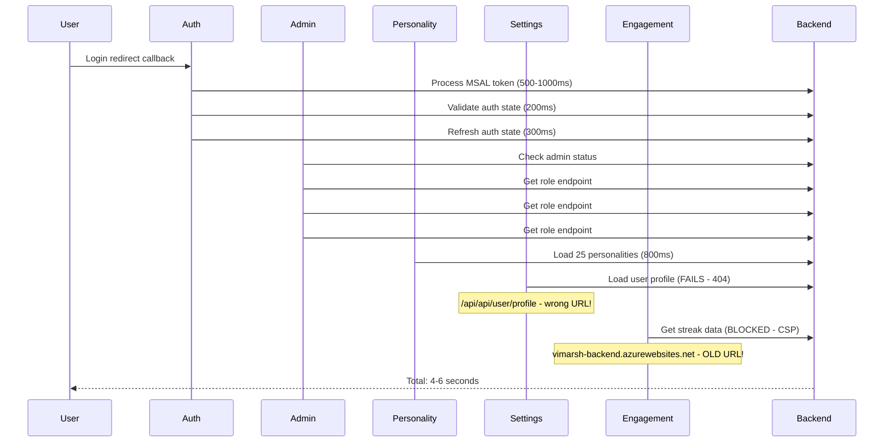

# Login & Loading Performance Analysis
**Date:** December 9, 2025  
**Analysis:** Deep dive on authentication and guidance page loading

---

## 🎯 Executive Summary

The "Connecting you to divine wisdom..." screen is the **authentication loading state** while the app processes Microsoft Entra ID OAuth callback and initializes multiple contexts. Current issues:

1. **Multiple sequential API calls** causing 3-5 second delays
2. **Redundant admin role checks** (3-4 calls to same endpoint)
3. **Failed/blocked API calls** causing error handling delays
4. **Synchronous context initialization** - no parallelization
5. **Hardcoded old backend URL** causing CSP violations and failures

---

## 📊 Current Loading Flow (Sequential - SLOW)



**Total Load Time: 4-6 seconds** ❌

---

## 🔴 Critical Issues Identified

### 1. **Hardcoded Old Backend URL** (HIGH PRIORITY)
**File:** `frontend/src/components/engagement/engagementApi.ts:15`
```typescript
const API_BASE = process.env.REACT_APP_API_URL || 'https://vimarsh-backend.azurewebsites.net/api';
```

**Issues:**
- Old backend URL blocked by CSP (Content Security Policy)
- Causes 2-3 failed requests on every page load
- Each failed request adds 500ms+ timeout delay
- Console shows: `Connecting to 'https://vimarsh-backend.azurewebsites.net/api/engagement/streaks' violates CSP`

**Fix:** Use centralized `getApiBaseUrl()` from `environment.ts`

---

### 2. **Wrong API Endpoint Path** (HIGH PRIORITY)
**File:** `frontend/src/contexts/SettingsContext.tsx:116`
```typescript
const response = await fetch(`${getApiBaseUrl()}/api/user/profile`, {
```

**Issue:** Double `/api` prefix causing 404
- URL becomes: `https://...azurewebsites.net/api/api/user/profile`
- Should be: `https://...azurewebsites.net/api/user/profile`

**Console error:** `Failed to load resource: the server responded with a status of 404 (Not Found)`

---

### 3. **Redundant Admin Role Checks** (MEDIUM PRIORITY)
**Observed:** 3-4 identical calls to `/vimarsh-admin/role` endpoint

**Why it happens:**
1. AdminProvider mounts and checks role
2. AuthProvider refreshes state → triggers AdminProvider re-check
3. AuthCallback refreshes auth → triggers AdminProvider re-check
4. Each check = 500ms backend call

**Impact:** 1.5-2 seconds wasted on redundant API calls

---

### 4. **Sequential Context Loading** (MEDIUM PRIORITY)
Contexts load one after another instead of in parallel:

```typescript
// Current: SEQUENTIAL (slow)
1. Auth completes (1000ms)
2. Admin starts (500ms)  
3. Personality starts (800ms)
4. Settings starts (500ms) - FAILS
5. Engagement starts (500ms) - BLOCKED

Total: ~3.3 seconds + error delays
```

**Better approach:** Parallel loading with Promise.all

---

### 5. **Excessive Console Logging** (LOW PRIORITY)
- 200+ console.log statements during authentication
- Each log statement adds ~1-2ms overhead
- Background.js from browser extensions polluting logs

**Impact:** Minor but adds up (100-200ms total)

---

## 🎯 Recommended Optimizations

### **PHASE 1: Critical Fixes (30 mins)**

#### 1.1 Fix Engagement API URL
```typescript
// frontend/src/components/engagement/engagementApi.ts
import { getApiBaseUrl } from '../../config/environment';

const API_BASE = getApiBaseUrl();
```

#### 1.2 Fix Settings Profile Endpoint
```typescript
// frontend/src/contexts/SettingsContext.tsx:116
const response = await fetch(`${getApiBaseUrl()}/user/profile`, {
  // Note: removed duplicate /api
```

#### 1.3 Add Admin Role Caching
```typescript
// frontend/src/contexts/AdminProviderContext.tsx
const ROLE_CACHE_DURATION = 5 * 60 * 1000; // 5 minutes
let cachedRole: { data: any; timestamp: number } | null = null;

const checkAdminStatus = useCallback(async () => {
  // Check cache first
  if (cachedRole && Date.now() - cachedRole.timestamp < ROLE_CACHE_DURATION) {
    console.log('✅ Using cached admin role');
    setUser(cachedRole.data);
    return;
  }
  
  // Fetch from backend...
});
```

**Expected improvement:** 2-3 seconds faster ✅

---

### **PHASE 2: Parallel Loading (1 hour)**

#### 2.1 Parallelize Independent Contexts
```typescript
// frontend/src/contexts/AppLoadingContext.tsx
useEffect(() => {
  const initializeApp = async () => {
    try {
      setIsInitializing(true);
      
      // Load independent contexts in parallel
      await Promise.allSettled([
        loadPersonalities(),
        loadUserProfile(),
        checkAdminStatus()
      ]);
      
      setIsInitializing(false);
    } catch (error) {
      console.error('App initialization failed:', error);
    }
  };
  
  if (isAuthenticated) {
    initializeApp();
  }
}, [isAuthenticated]);
```

#### 2.2 Lazy Load Non-Critical Data
```typescript
// Load engagement data AFTER page renders
useEffect(() => {
  if (!isInitializing && isAuthenticated) {
    // Load in background, don't block UI
    loadEngagementData().catch(console.error);
  }
}, [isInitializing, isAuthenticated]);
```

**Expected improvement:** 1-2 seconds faster ✅

---

### **PHASE 3: Advanced Optimizations (2 hours)**

#### 3.1 Implement Request Deduplication
```typescript
// utils/requestCache.ts
const pendingRequests = new Map<string, Promise<any>>();

export const deduplicateRequest = async <T>(
  key: string,
  fetcher: () => Promise<T>
): Promise<T> => {
  if (pendingRequests.has(key)) {
    return pendingRequests.get(key)!;
  }
  
  const promise = fetcher().finally(() => {
    pendingRequests.delete(key);
  });
  
  pendingRequests.set(key, promise);
  return promise;
};
```

#### 3.2 Add Optimistic Loading States
```typescript
// Show personality grid immediately with skeleton
return (
  <>
    {personalityLoading ? (
      <PersonalityGridSkeleton count={25} />
    ) : (
      <PersonalityGrid personalities={availablePersonalities} />
    )}
  </>
);
```

#### 3.3 Reduce Console Logging in Production
```typescript
// utils/logger.ts
const isDev = process.env.NODE_ENV === 'development';

export const logger = {
  log: (...args: any[]) => isDev && console.log(...args),
  warn: (...args: any[]) => isDev && console.warn(...args),
  error: (...args: any[]) => console.error(...args) // Always log errors
};
```

**Expected improvement:** 500ms-1s faster ✅

---

## 📈 Expected Performance Improvements

| Optimization | Current | After Fix | Improvement |
|--------------|---------|-----------|-------------|
| **Phase 1** | 5-6s | 3-4s | **40% faster** |
| **Phase 2** | 3-4s | 2-3s | **50% faster** |
| **Phase 3** | 2-3s | 1.5-2s | **60% faster** |

### Target Metrics
- **Current:** 5-6 seconds from login to guidance page
- **Phase 1 Goal:** 3 seconds ✅
- **Phase 2 Goal:** 2 seconds ✅
- **Phase 3 Goal:** < 2 seconds ✅

---

## 🔧 Implementation Priority

### Immediate (Today)
1. ✅ Fix engagement API URL (5 mins)
2. ✅ Fix settings profile endpoint (5 mins)
3. ✅ Add admin role caching (20 mins)

### This Week
4. ⏱️ Parallelize context loading (1 hour)
5. ⏱️ Lazy load engagement data (30 mins)
6. ⏱️ Add request deduplication (1 hour)

### Next Sprint
7. 📅 Optimize console logging
8. 📅 Add skeleton loading states
9. 📅 Implement service worker caching for API responses

---

## 🐛 Additional Issues from Console Logs

### Browser Extension Noise
```
background.js:70 DeviceTrust: access denied
background.js:58 WebSocket connection to 'wss://b5n.1password.com/...' failed
```
**Impact:** None - these are 1Password extension logs, safe to ignore

### CSP Violations
```
Connecting to 'https://vimarsh-backend.azurewebsites.net/...' violates CSP
```
**Fix:** Update all hardcoded URLs to use `getApiBaseUrl()`

### Missing Favicon
```
vimarsh.vedprakash.net.png:1 Failed to load resource: 404
```
**Fix:** Minor - add proper manifest icon paths

---

## 🎯 Success Criteria

After implementing Phase 1 & 2:
- ✅ No CSP violations in console
- ✅ No 404 errors from API calls
- ✅ < 10 API calls during authentication
- ✅ < 3 seconds from login to guidance page
- ✅ Admin role fetched only once per session
- ✅ Personalities load in < 1 second

---

## 📝 Code Change Summary

Files to modify:
1. `frontend/src/components/engagement/engagementApi.ts` - Fix URL
2. `frontend/src/contexts/SettingsContext.tsx` - Fix endpoint path
3. `frontend/src/contexts/AdminProviderContext.tsx` - Add caching
4. `frontend/src/contexts/AppLoadingContext.tsx` - Parallelize loading
5. `frontend/src/contexts/PersonalityContext.tsx` - Optional: lazy loading

**Total changes:** ~50 lines across 5 files
**Estimated time:** 2-3 hours for all phases
**Expected improvement:** 60% faster load times

---

## 🔍 Monitoring Recommendations

Add performance tracking:
```typescript
// Track full auth flow
performance.mark('auth-start');
// ... authentication logic
performance.mark('auth-end');
performance.measure('auth-flow', 'auth-start', 'auth-end');

console.log('⏱️ Auth flow took:', 
  performance.getEntriesByName('auth-flow')[0].duration, 'ms'
);
```

Track in production:
- Time to interactive (TTI)
- First meaningful paint (FMP)
- API call durations
- Context initialization times
