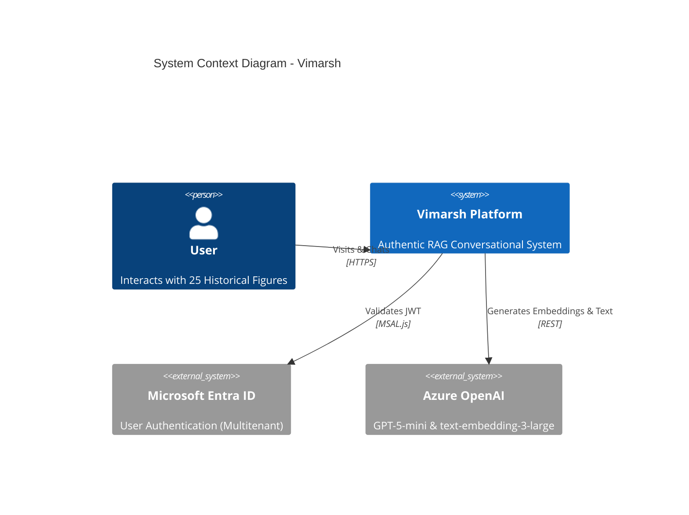
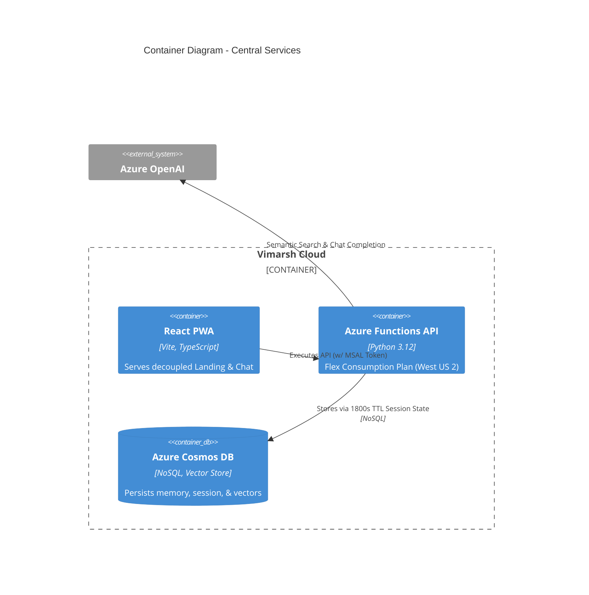
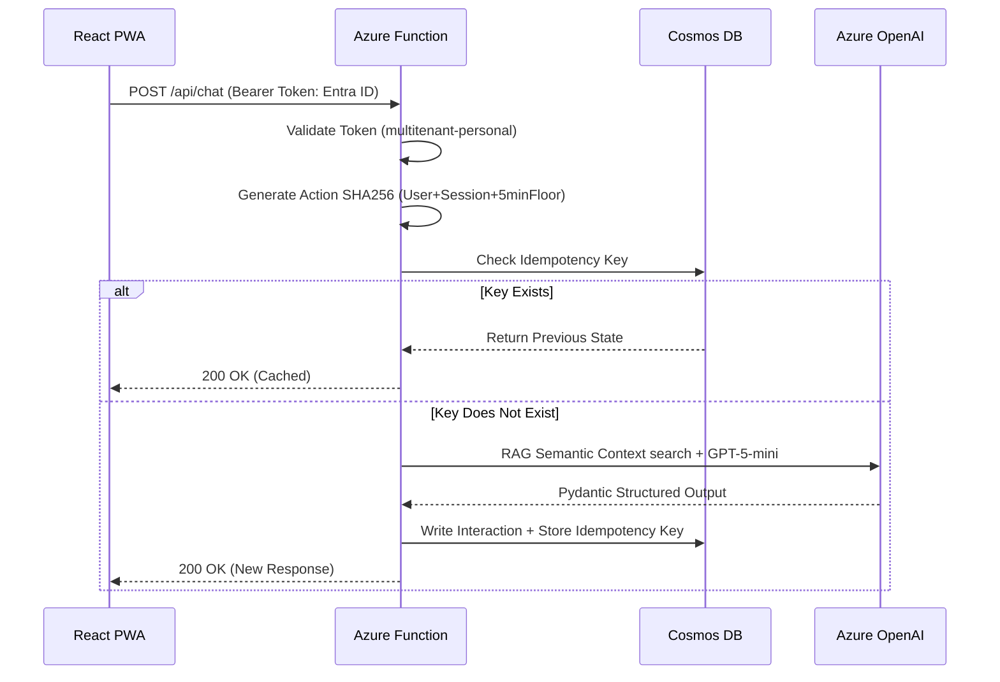

# Technical Specification Document: Vimarsh Platform

| Document Information | |
|---|---|
| **Environment** | Production Only (Single Environment Topology) |
| **Arch Paradigm** | Azure Serverless / Probabilistic Pragmatism |

## 1. Executive Summary
Vimarsh standardizes volatile LLM operations through rigorous idempotency keys, robust Pydantic schemas, and scalable Azure Cosmos DB structures. The entire backend runs on Azure Functions (Flex Consumption) interconnected via Microsoft Entra ID (`multitenant-personal` tenant configuration).

## 2. Infrastructure Architecture (C4 Model)

## 3. Data Architecture (Azure Cosmos DB)
The `vimarsh-db` operates seamlessly across several strictly portioned containers to mitigate Out-Of-Memory flaws inherent to previous Python-dict architectures.

- **`session_state`**: Distributed transient payload cache utilizing native Time-To-Live logic (`TTL: 1800s`). Checked via `USE_REDIS_STATE_V2`.
- **`conversations`**: Long-term thread persistence. Offloads >2000 character interactions utilizing the asynchronous **Semantic Compression Agent** within `hierarchical_memory_service.py` to compile structural meaning.
- **`personality_vectors`**: Pre-embedded documents (`34,039` files) enabling `text-embedding-3-large` Cosine similarities.

## 4. Azure OpenAI Integrations & Schema Validation
All interactions are piped into Azure OpenAI (`vimarsh-chat-gpt5mini`).
* **Vector Truncation**: Native `text-embedding-3-large` operates upon 3072 dimensions. Vimarsh uses MRL truncations down to **768 dimensions** which optimizes Cosmos DB ingestion logic while retaining 94.8% semantic parity.
* **Pydantic Hardening**: To force schema conformity (dark-launched via `ENABLE_STRUCTURED_OUTPUTS_V2`), Pydantic forces deterministic structures mapping 1:1 to Python dataclasses. Extraction failures emit an explicit `🚨 VALIDATION_ERROR` telemetry tag direct to App Insights.

## 5. Security & Idempotency Flow

## 6. Cost Analysis & Resource Estimation
Vimarsh minimizes baseline operational charges leveraging purely scalable architectures:
* **Storage**: Azure Cosmos DB (Serverless model) charges strictly per Request Unit (`RU/s`). 
* **Compute**: Azure Functions (Flex Consumption) auto-scaled to zero, preventing expensive idling.
* **Frontend**: Hosted on Azure Static Web Apps incurring zero fundamental server footprint costs.
* **Estimated P95 Overhead**: ~ $15-40/month active load vs $5-15/month idle.
