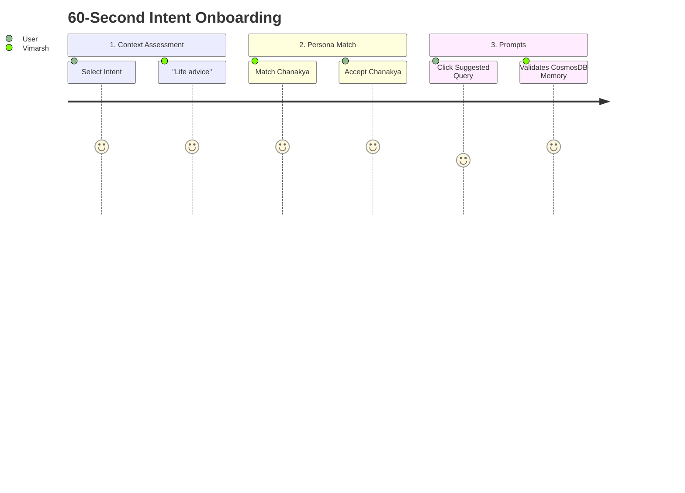

# User Experience (UX) Specification: Vimarsh Platform

| Document Information | |
|---|---|
| **Design Language** | Apple Clean Aesthetic / Domain CSS Modules |
| **Platforms** | Native PWA (iOS, Android, macOS, Windows) |

## 1. Executive Summary
"Authentic Wisdom Through Intuitive Design."
The UX interface manages cognitive load by separating operational analytics from the conversation canvas. It introduces uncoupled routing for casual guests and natively bounds 6 distinct thematic CSS palettes based closely on historical personality selections.

## 2. Empathy Maps & User Personas

### 2.1 Persona 1: "The Reflective Guru" (Seeker)
- **Says**: "I need objective ancient philosophy applied to modern burnout."
- **Thinks**: Wants profound answers without dense, academic, unnavigable text.
- **Does**: Skims rapidly, focuses on aesthetic ease, utilizes quick mobile prompts.
- **Feels**: Overwhelmed by modern choices. Demands visual calm (`Contemplative Wisdom` domain).

### 2.2 Persona 2: "The Scholar" (Leader/Researcher)
- **Says**: "Which exact scripture did this advice originate from?"
- **Thinks**: Requires trust. Values correct citations. 
- **Does**: Click source validations. Expects serious typography (`Timeless Authority`).
- **Feels**: Skeptical of AI hallucinations. Demands strict accuracy.

## 3. Wireframes & Layout Mechanics

### 3.1 Uncoupled Landing User Interface
```mermaid
graph TD
    A[Global Top Nav: Vimarsh Logo / Settings] --> B[Hero Section: Apple-inspired Carousel Showcase]
    B --> C[Intent Onboarding Modal: "What brings you here?"]
    B --> D[Domain Selector: 25 Personalities Cards]
    
    C --> |Casual Click| E[Unauthenticated Preview Flow]
    C --> |Auth Verified via MSAL| F[Native Route: /guidance]
```

### 3.2 Main Conversational Canvas (`GuidanceInterface`)
```text
+-------------------------------------------------------------+
| Vimarsh 🔥 12 days    [🎭 Krishna ▼]   [Profile] [Settings] |
+-------------------------------------------------------------+
|                                                             |
|   +-----------------------------------------------------+   |
|   | 🕉️ Krishna (Spiritual)                              |   |
|   | ─────────────────────────────────────────────────── |   |
|   |  "You have the right to work, but never to the      |   |
|   |   fruit of work..."  [Bhagavad Gita 2:47]           |   |
|   +-----------------------------------------------------+   |
|   | 📤 Share Card    |    ➕ Wisdom Journal             |   |
|                                                             |
|   +-----------------------------------------------------+   |
|   |  I am struggling with my responsibilities...     [↗] |   |
|   +-----------------------------------------------------+   |
+-------------------------------------------------------------+
```

## 4. Design System & Domain Theming
Legacy inline styling was globally deprecated replacing React bloat with `GuidanceInterface.css` component CSS. 

| Domain | CSS Identifier | Color Token | Typography Rules |
|---|---|---|---|
| **Spiritual** | `theme-spiritual` | Saffron `#f97316` | Crimson Text (Citations) |
| **Philosophical** | `theme-philosophy` | Stoic Gray `#6b7280` | Libre Baskerville |
| **Leadership** | `theme-leadership` | Auth Blue `#1e40af` | Montserrat Headers |
| **Scientific** | `theme-scientific` | Lab Teal `#14b8a6` | Monospaced Metrics |

## 5. Gamified Engagement Journeys

### 5.1 Onboarding


### 5.2 Streaks & Badges
* **Consistency Ticker**: Centralized on the top navigation.
* **PWA Capability**: Push notifications and background caching permit users continuous access even offline, triggering badges (e.g., "7-Day Consistent Seeker", "Einstein Apprentice").
